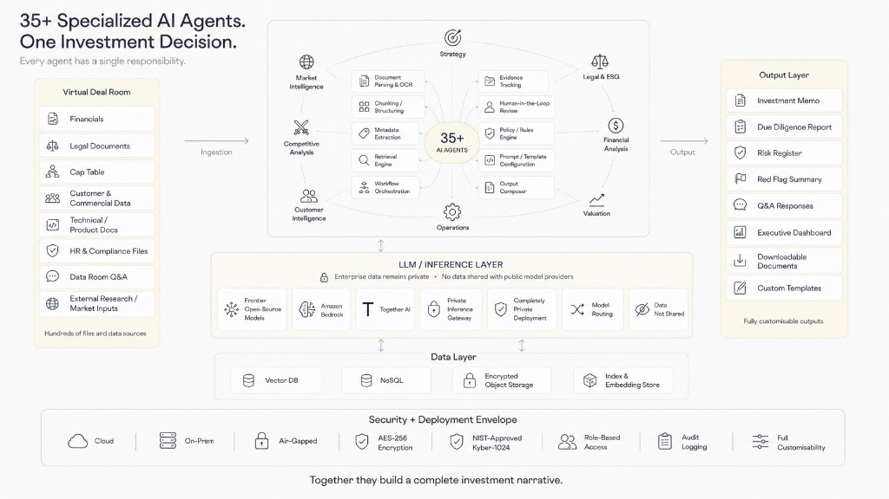
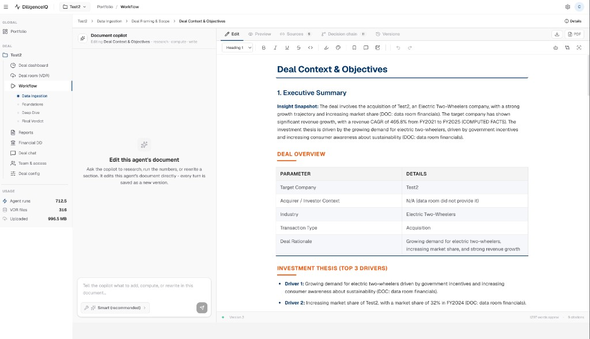
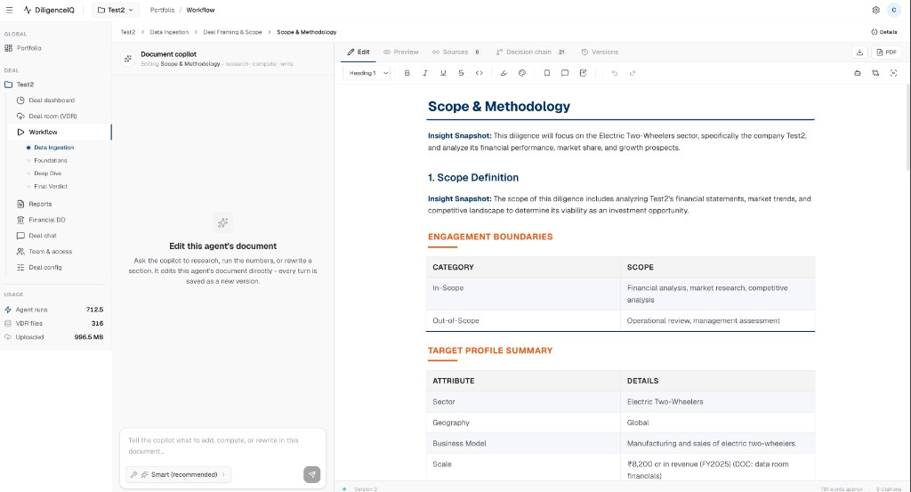

# Agentic CDD — Product & System Context

> Source of truth from Genovation Technological Solutions executive materials.
> Do not implement from this file unless explicitly asked.

## Product

**Agentic CDD** is an AI multi-agent Commercial Due Diligence platform.

Users manage a **Portfolio** of dealrooms. Creating a dealroom creates a deal workspace/folder that runs (or will run) the agentic CDD pipeline.

Existing UI (prototype): Portfolio dashboard, Create Dealroom modal → investment portfolio → deal folder under `data/deals/<slug>/`.

**Live shipping reference:** DiligenceIQ (Next.js + `/api/v1` backend) — see [Live reference app — DiligenceIQ](#live-reference-app--diligenceiq-observed-flow). Executive slides in this file remain the Genovation agent taxonomy (F/DD/FV/RG); the live app uses slug agent keys and **43** agents / **5** reports.

---

## Executive system architecture (Genovation slide)

> Source image: [`docs/reference/architecture-35-agents-investment-decision.png`](docs/reference/architecture-35-agents-investment-decision.png)  
> Title: **“35+ Specialized AI Agents. One Investment Decision.”**  
> Tagline: Every agent has a single responsibility · Together they build a complete investment narrative.  
> Context only — do not implement from this section unless explicitly asked.



### Left — Virtual Deal Room (ingestion)

Hundreds of files and data sources, including:

- Financials  
- Legal Documents  
- Cap Table  
- Customer & Commercial Data  
- Technical / Product Docs  
- HR & Compliance Files  
- Data Room Q&A  
- External Research / Market Inputs  

Flow arrow: **Ingestion →** agent core.

### Center — 35+ AI Agents (two rings)

**Outer ring — strategic domains (analysis roles):**

| Domain |
|---|
| Market Intelligence |
| Competitive Analysis |
| Customer Intelligence |
| Operations |
| Valuation |
| Financial Analysis |
| Legal & ESG |
| Strategy |

**Inner ring — functional / platform agents (pipeline mechanics):**

| Function | Relevance notes |
|---|---|
| Document Parsing & OCR | Messy scans/PDFs; OCR can misread commas, %, segment vs total, quarter vs year |
| Chunking / Structuring | Normalize extracted content into usable blocks |
| Metadata Extraction | File / period / statement-type labels |
| Retrieval Engine | Evidence pull for analysis agents |
| Workflow Orchestration | Phase / cascade / run control |
| Output Composer | Assembles terminal packs (reports, memos, dashboards) |
| Prompt / Template Configuration | System / user / output-format layers |
| Policy / Rules Engine | Natural home for zero-trust reconcile rules (block usable only if rows tie to printed subtotal) |
| Human-in-the-Loop Review | Review of held-out / contested rows before databook promotion |
| Evidence Tracking | Provenance for accepted vs held-out figures |

Flow arrow: **Output →** deliverables.

### Right — Output layer (fully customisable)

- Investment Memo  
- Due Diligence Report  
- Risk Register  
- Red Flag Summary  
- Q&A Responses  
- Executive Dashboard  
- Downloadable Documents  
- Custom Templates  

Maps onto our Phase 5 / Reports surface (IC Memo, Strategy Report, Market/CDD decks, Ops Dashboard, plus broader document/Q&A outputs).

### Underpinning layers (shown under the agent core)

**LLM / Inference** — enterprise data privacy; data not shared with public providers. Components called out: Frontier open-source models · Amazon Bedrock · Together AI · Private Inference Gateway · Completely Private Deployment · Model Routing.

**Data layer** — Vector DB · NoSQL · Encrypted Object Storage · Index & Embedding Store.

**Security + deployment envelope** — Cloud · On-Prem · Air-Gapped · AES-256 · NIST-approved Kyber-1024 · Role-Based Access · Audit Logging · Full Customisability.

### Mapping to this workspace (status)

| Slide concept | In Agentic CDD today | Gap |
|---|---|---|
| Virtual Deal Room | VDR upload + deal folders | — |
| Domain agents (outer ring) | Phases 2–4 slug agents + stores | — |
| Document Parsing & OCR | Partial ingest / extract; OCR called out in Phase 1 design | Not a full OCR quality gate |
| Policy / Rules + HITL + Evidence | Decision chains, ops figure-conflict WARN rows | **No** statement-block reconcile → hold-out databook |
| Output Composer | 5 report builders (on-demand Generate) | Broader output types (risk register, red-flag pack, etc.) still thin |
| LLM / Data / Security envelope | Local FastAPI + FS + JWT; private-deploy story not fully productized | Bedrock/Together/air-gap as deployment options |

**Implication for “zero-trust financials”:** the slide treats parsing/OCR, policy/rules, HITL review, and evidence tracking as **first-class functional agents**, separate from domain analysis and from the Output Composer. That capability is **designed** here; it is **not required** for current report Generate to run, and it is **not yet built** as a reconcile-and-hold-out databook component.

**Authoritative product requirement for Databook:** see [CDD Databook — DiligenceIQ review guide (requirement context)](#cdd-databook--diligenceiq-review-guide-requirement-context) below. Implement in **`agetic-cdd`** (this folder) when scheduled — not in `agetic-cdd-guided`.

**Design & implementation plan:** [`docs/plans/databook-design-implementation.md`](docs/plans/databook-design-implementation.md) (architecture, domain model, API/UI, phased delivery, verification).

**Shipped so far (Phase 0–4 + Excel HITL):** file-backed `databook/` store; dictionary metric map + family gates; series drop + conflicts; statement-block reconcile (fail → hold-out); HITL **Correct / Drop / Vouch / Accept proposal** (+ reason audit); Re-read one file / **Deep** all originals / **Refresh** UI-only; Findings trust ledger + uploaded-files triage; materiality filter + promoted CSV; **Export to Excel / Import edited Excel**; **Databook is up to date / Update databook** freshness control; `historical_performance` + ops dashboard / CDD deck prefer **promoted.json** (agent WARNs demoted when databook resolved); `GET/POST …/cdd/databook*` + `GET …/cdd/data-quality`; Deal nav **Databook** UI.

**PDF design matrix (VDR→Databook contract):** [`docs/plans/databook-design-requirements-matrix.md`](docs/plans/databook-design-requirements-matrix.md).

---

## FDD Report & Deck — DiligenceIQ design (requirement context)

> **Status:** Context / requirements + implementation plan — **Phase 0–3 landed 2026-10-07** (foundations + bridge + readiness/scope + claims ledger).  
> **Source PDF:** [`DiligenceIQ_FDD_Report_and_Deck_Creation_Design.pdf`](DiligenceIQ_FDD_Report_and_Deck_Creation_Design.pdf) (Sep 28, 2026 · 71 pages).  
> **Requirements matrix:** [`docs/plans/fdd-report-design-requirements-matrix.md`](docs/plans/fdd-report-design-requirements-matrix.md)  
> **Step-by-step build plan:** [`docs/plans/fdd-report-implementation.md`](docs/plans/fdd-report-implementation.md)  
> **Upstream:** Approved databook release only (R1). Release cells bridge into FDD facts/exhibits; **draft mode** + **G6 blocked** until contract complete.

### Five rules (non-negotiable)

1. Numbers only from the approved databook via versioned models.  
2. Agents supply questions / leads / qualitative evidence — **never** exhibit figures.  
3. VDR retrieval is for missing / doubtful / disputed; finds re-enter the **databook**, not the report.  
4. People approve judgements (scope, material adjustments, conclusions) — not arithmetic.  
5. One report specification feeds **both** the FDD report and the IC deck.

### Critical path

Phases **0 → 1 → 3 → 5a (QoE) → 6 → 8** (PDF §9). Start with exhibit store + number tokens; do **not** write report prose before QoE.

> **Sequencing (2026-10-08):** Databook G1–G6 landed. **FDD Phase 0–3 + 5a + 5b (M1/M2/M7 + M8/M5/M6) + 6 + 7 + 8 + 9 (goldens/ship gate) landed**. Figure-integrity: workbook EBITDA basis + gap notes (size/source); aligned exhibit counts; empty model exhibits omitted (no “figures pending”); long-term liabilities / SBA CoA for net debt. Next: M3 / Phase 4 deepen / expand goldens. Track: [`docs/plans/fdd-report-implementation.md`](docs/plans/fdd-report-implementation.md).

---

## CDD Databook — DiligenceIQ review guide (requirement context)

> **Status:** Context / requirements only — **do not treat as implemented.**  
> **Source PDF:** [`DiligenceIQ CDD Databook User Guide.pdf`](DiligenceIQ%20CDD%20Databook%20User%20Guide.pdf) (DiligenceIQ Product Guide · August 2026 · “CDD Databook Review Guide”).  
> **Extracted text:** [`docs/reference/diligenceiq-cdd-databook-user-guide.txt`](docs/reference/diligenceiq-cdd-databook-user-guide.txt)  
> **Purpose in this repo:** Spec for building a checked, traceable financial history in **Agentic CDD** so agents and reports consume **proven** numbers, not silent OCR guesses.

### Product intent

| Principle | Meaning |
|---|---|
| **The point** | Use the databook **only when the evidence supports it** |
| **Reviewer role** | Resolve **exceptions**; do **not** simply clear warnings |
| **Done means** | Material rows **tie**, and judgement calls are **recorded** |
| **Working principle** | Conservative / **zero trust**. If a row cannot be proven, it stays **visible but out of the databook** until a reviewer decides |

A databook is **not** “a table of extracted numbers.” It is a **chain of evidence**:

`source document → extracted row → mapped metric → arithmetic check → reviewer decision → databook output`

DiligenceIQ builds the first pass (read VDR, extract tables, map line items, check statement blocks against **printed subtotals**). Reviewers handle what the app cannot prove.

**Reviewer rule:** Leave the databook so another deal-team member can see why every **material** number was **accepted, corrected, dropped, or vouched**.

### Why the system refuses numbers

Diligence files are messy (scans, PDFs, board packs, models, exports). OCR can lose commas, misread `%` vs value, confuse segment vs total, or quarter vs year.

- A **statement block** is usable **only** when its rows reconcile to the **subtotal printed in the source**.
- If the block does not tie → affected rows are **held out** (visible for review; **do not** silently enter the databook).
- Example: Revenue 100 + Other income 20 = Total income 120 must check arithmetically; if not, hold the block — do not guess which cell is wrong.
- **One check = one block × one period** (e.g. 7 blocks × 3 years → 21 checks). One file can create many held-out rows.

### Three UI surfaces (review loop)

| Surface | Use for | Reviewer action |
|---|---|---|
| **Uploaded files** | Review queue + source-level warnings | Triage flags, inspect rows, decide follow-up |
| **Derived data** | Databook summary + every extracted line item | Correct, map metrics, drop noise, vouch, export |
| **Findings** | File-by-file **trust ledger** | Find which source blocks trust; re-read selected file |

Buckets/filters are **worklists**, not final verdicts.

### Four flags — clear in this order

| Order | Flag | Why it matters | Decision |
|---|---|---|---|
| 1 | **Assumption made** | Wrong currency/scale can pass arithmetic but still be wrong | Is unit/currency correct for deal/row? Fix deal params + Rescan, or correct row |
| 2 | **Sources disagree** | Same metric/period, different values | Which source **governs**, or is the delta itself a diligence finding? Do not silent-override |
| 3 | **Unread** | Page/sheet not read as a period-based financial table | Real databook input vs non-data (intro, TOC, disclaimer)? |
| 4 | **Not landed** | Row-shaped but not normalised into analysis | Noise to drop, or fix source/rules and rerun? |

**Language:** “No figure extracted” / missing period means **absent from the table**, **not zero**. Never treat missing as nil unless the source says so.

**Practical distinction:**

- **Unmapped** = read but not recognised as a standard metric (mapping issue).  
- **Left out / held out** = may be known but **not proven** (trust issue).

### Fixing a held-out row (actions are not interchangeable)

| If the fault is… | Action | Meaning |
|---|---|---|
| In the reading | **Save correction** | Machine misread; correct value/metric + **reason** → can flow into databook |
| Not a figure | **Not a figure — drop it** | Remove % / page number / footnote / non-financial token |
| In the check | **Vouch for it** | Read was correct; reviewer **releases** row on their authority + recorded decision |
| In the file | **Re-read** | Re-extract that document from scratch |

**Discipline:** Correcting ≠ vouching. **Never vouch just to clear a list.**

### Findings as trust ledger

- Derived data = **rows**; Findings = **documents**.
- Example signal: `21/21 checks failed` and `703 rows held out` on one file → put review effort there.
- **Silence is not a pass:** a file with no financial table produces **no** checks (neither passed nor failed). Confirm contribution before treating silence as comfort.

### Rerun with intent

| Button | Meaning | When |
|---|---|---|
| **Rescan** | Re-apply extraction/mapping on **cached** text | Deal params, rules, mapping, or correction; text still OK |
| **Deep** | Discard stored text; re-read **all** originals | Bad/garbled cache or OCR/reader fix |
| **Re-read** | Deep for **one** file | Known bad document; cheaper |
| **Refresh** | UI state only | Does **not** re-extract |

### When the source must be fixed (outside the app)

Ask for native PDF/Excel; re-upload; or build a clean supporting schedule:

- One header row (years across, line items down)  
- One number per cell; no text in number cells  
- No merged cells / spacer rows / footnotes in number cells  
- Currency/units stated (e.g. GBP millions)  
- Subtotals that add to the rows above  

### Guide’s stated product limitations (live DiligenceIQ)

- No dedicated review screen yet — inline edit in “All line items”.  
- Users can only edit rows headed for the databook.  
- Cannot overwrite a disagreement directly on the disagreement panel (by design — resolve via source review, row correction, or report commentary).

### Reviewer cheat sheet (acceptance language)

| You see | It means | Do this |
|---|---|---|
| Assumption made | Unit/currency inferred | Check source; fix deal params + Rescan or correct row |
| Sources disagree | Two values, same metric/year | Choose governing source; correct/drop; or record finding |
| Unread | Not read as table | Rule/clean schedule if real data; else ignore |
| Not landed | Could not normalise | Drop noise or fix source + rerun |
| Failed its check | Block does not add up | Correct, drop, vouch, or re-read |
| Unmapped | Not recognised as metric | Re-map if it should feed databook |
| No financial table found | Nothing checked in that file | Confirm whether file should have financials |
| Every statement used here ties | Material arithmetic checks passed | Proceed, with documented judgement/exceptions |

### Mapping to Agentic CDD (this workspace) — gap

| DiligenceIQ Databook concept | Agentic CDD today | Gap for implementation |
|---|---|---|
| Zero-trust statement-block reconcile | Partial extract; ops `detect_figure_conflicts` WARN in reports | **No** block-level tie → hold-out store |
| Held-out rows (visible, not in databook) | — | Need hold-out + promotion model |
| Uploaded files / Derived data / Findings | VDR + CDL + agent docs/reports | Need databook review surfaces |
| Four flags (assumption, disagree, unread, not landed) | — | Issue taxonomy + triage order |
| Correct / drop / vouch / re-read + audit reason | Copilot edits documents | Need row-level decisions with audit trail |
| Rescan / Deep / Re-read / Refresh | Databook Rescan / Deep / Re-read / UI Refresh | Done (Phase 4) |
| Canonical financial history for agents/reports | Agents/reports prefer **promoted.json** | Done (Phase 4) |
| Clean schedule guidance | — | Upload UX / pre-flight tips |

**Implementation note (deferred):** When building Databook in `agetic-cdd`, preserve this guide’s semantics (especially **hold-out vs vouch vs correct**, and **missing ≠ zero**). Do not flatten into an undifferentiated “22k issues” list — triage and materiality matter (see also trial feedback on Databook overload).

### Live DiligenceIQ data-quality API (Test2) — verification context

> **Purpose:** Golden contract for Databook conflict/drop surfacing. Capture only — do not implement until Databook work is scheduled.  
> **UI:** [Test2 VDR](http://143.110.187.183:3001/deals/test2/vdr)  
> **API:** `GET http://143.110.187.183:4600/api/v1/portfolios/{deal_id}/cdd/data-quality`  
> **Example deal_id:** `64b083aa47f4`  
> **Fixture (schema + representative cases):** [`docs/reference/diligenceiq-data-quality-test2-fixture.json`](docs/reference/diligenceiq-data-quality-test2-fixture.json)

**Observed response shape**

```json
{
  "items": [ /* issue objects */ ],
  "summary": {
    "total": 77,
    "by_kind": { "dropped": 4, "conflict": 73 },
    "needs_review": 77
  }
}
```

**Item kinds**

| `kind` | Meaning | Key fields |
|---|---|---|
| `dropped` | Value excluded from series (e.g. ratio mistaken for amount) | `source`, `reason`, `detail.{metric,fiscal_year,value}` |
| `conflict` | Competing values for same metric+year; system auto-`chosen` one | `metric`, `fiscal_year`, `chosen`, `candidates[]`, `scope`, `rule` |

**Conflict `scope`:** `across documents` | `within one document`  

**Default `rule` (heuristic ranking):** most documents stating it → that source’s coverage of this metric → how much of the fact base the source supplies → how plainly the caption names the metric → most central value.

**Candidate object fields:** `value`, `sources[]`, `captions[]`, `chosen`, `stated_by`, `source_facts`, `source_total_facts`.

**Test2 patterns we must verify against when building**

1. **Across-doc Revenue disagreement** — Commercial DD vs Exec Summary (e.g. FY2022 Revenue `1.9e9` vs `4.56e9`, captions both `Revenue (INR Cr)`).
2. **Within-doc segment conflicts** — e.g. Revenue Share (%) / Units Share (%) / YoY Growth with 5 candidates inside one PDF; chooser picks a “central” value.
3. **Series drops** — NRR/GRR-like `81` / `74` dropped from Revenue / `net_revenue_usd_m` as “orders of magnitude below the series centre - a ratio, not the amount”.
4. **Near-duplicate inflation** — same conflict reappears across extract passes → `needs_review` inflated (do not copy this blindly).
5. **Critical anti-goal (live DIQ bug):** Revenue FY2024 sometimes **chosen = 320** (`Units Sold`, `stated_by: 2`) over real Revenue candidates `3.14e10` / `4.9e10`, with NRR/GRR/Churn also in the candidate list. Our Databook must **not** silently promote that; metric-identity gates + HITL override are mandatory.

**Acceptance checks (when we implement)**

- Endpoint (or Databook equivalent) returns `{ items, summary }` with `summary.by_kind` matching items.
- Conflicts always expose candidates + chosen + scope + rule; drops always expose reason + detail.
- Test2-like pack surfaces Exec Summary vs Commercial DD Revenue disagreements.
- UI maps `conflict` → **Sources disagree**; series `dropped` → triage as **Not landed** / assumption-class noise.
- Auto-`chosen` is never silent-final: user can Correct / Drop / Vouch with audit; Units Sold / retention ratios cannot win a Revenue conflict.

---

## Scale

| Dimension | Count |
|---|---|
| VDR input files (reference deal) | 37 |
| File formats | 6 — PDF, XLSX, CSV, DOCX, PPTX, TXT |
| AI agents | 41 — 37 analysis · 2 ingestion · 2 orchestration |
| Phases | 5 |
| Terminal deliverables | 4 |

Every agent accepts **user prompt overrides** for customization.

---

## End-to-end flow

```
Data Room → Upload → AI Reads & Sorts → Central Data Library
  → Foundations (Deal Strategy → Company Profile)
  → AI Analysis
  → Deep Dive (6 parallel tracks)
  → Final Verdict (Risks & Growth → Valuation → Summary & Recommendation)
  → Final Reports (Strategy · Market Deck · Ops Dashboard · IC Memo)
```

### Additive data stores

1. **Central Data Library** (Phase 1)
2. **Foundation Context Store** (Phase 2)
3. **Deep Dive Findings Store** (Phase 3)
4. **Verdict Store** (Phase 4)

Phase 5 consumes prior stores only (no further store).

---

## Phase 1 — Data Ingestion (2 agents)

**Scale:** 37 VDR files · 6 formats · 2 sequential system agents · 1 Central Data Library  
**Flow:** Virtual Data Room → Upload → AI Reads & Sorts → Central Data Library  
**Pipeline:** VDR (37 raw files) → **DI-01 Ingestor** (parse & extract) → **DI-02 Classifier** (classify & route) → Central Data Library (indexed store)

DI-01 and DI-02 are the **upstream roots** of the pipeline. Every later agent depends on their output. The library feeds **37 downstream analysis agents** across Phases 2–5 (F-01…06, DD-01…24, FV-01…07; RG-01…04 consume via later stores, not raw VDR).

### Sequential 4-step architecture

1. **Virtual Data Room** — 37 files in 6 formats: `.pdf` · `.xlsx` · `.csv` · `.docx` · `.pptx` · `.txt`
2. **DI-01 Document Ingestor** — reads all 37 files; extracts text, tables, metadata; normalizes to a unified schema; OCR enabled for scanned PDFs; flags corrupted/unreadable files  
   **Output:** 37 Parsed Document Objects
3. **DI-02 Data Classifier & Router** — classifies into 7 categories; routes to Phase 2/3 agents; master index; duplicate handling; confidence-scored classification  
   **Output:** Central Data Library
4. **Central Data Library** — unified, classified, indexed store accessible by all Phase 2, 3, 4, and 5 agents

**Reference mix:** 10 PDF · 13 XLSX · 9 CSV · 2 DOCX · 1 PPTX · 2 TXT

### DI-01 Document Ingestor (system agent · step 1 of 2)

**Input:** 37 raw VDR files (all 6 formats) — financials, legal (NDA, articles, process letter), market (Gartner MQ, stats), customer (CRM, usage, churn), strategy (CIM, teaser), org chart, ESG, supplier lists.

**Processing steps:**
1. File format detection  
2. Text extraction (PDF, DOCX, PPTX)  
3. Table parsing (XLSX, CSV)  
4. Metadata extraction  
5. OCR for scanned pages  
6. Schema normalization  
7. Corruption / integrity check  
8. Classification tagging  

**Output — Parsed Document Objects (37 structured records):** full searchable text · parsed tables · metadata (author, date, version) · file classification tags (financial / legal / market / operational) · integrity status (clean / corrupted / flagged) · format normalization record

**Default prompt:** Parse all uploaded VDR documents. Extract full text, tables, and metadata. Classify each file by type (financial, legal, market, operational). Flag any corrupted or unreadable files.

**Params:** `file_types_to_prioritize` · `extraction_depth` {full | summary} · `OCR_enabled` {true | false} · `language_filter`

### DI-02 Data Classifier & Router (system agent · step 2 of 2)

**Input:** 37 Parsed Document Objects from DI-01 (text, tables, metadata, tags, integrity flags, normalized schema)

**Processing steps:**
1. Content-based classification into 7 default categories  
2. Multi-label assignment (primary + secondary)  
3. Confidence scoring  
4. Agent routing — map files to F-01…F-06 and DD-01…DD-24  
5. Master index creation  
6. Duplicate detection & handling  

**Output — Central Data Library:** primary category · secondary category · routed-to agent list · classification confidence score · Master Document Index with cross-references

**7-category taxonomy:** Deal/Strategy · Company/Mgmt · Market/Competition · Customer · Operations · Legal/ESG · Financial

**Default prompt:** Classify each document into primary categories: Deal/Strategy, Company/Management, Market/Competition, Customer, Operations, Legal/ESG, Financial. Route each document to appropriate Phase 2/3 agents. Create a master document index.

**Params:** `classification_taxonomy` · `routing_rules` · `duplicate_handling` {merge | keep_both} · `confidence_threshold` (below threshold → manual review)

### VDR file inventory (37 files by category)

DI-01 parses **all 37**. DI-02 classifies into 7 categories. Each file is routed to **1–3 downstream agents**.

| Category | Agents | Files |
|---|---|---|
| Deal / Strategy (4) | F-01…F-04 | `CyberGuard_CIM_Final.pdf` · `Project_Cyber_Teaser_v2.pdf` · `Process_Letter_Phase_1.pdf` · `Standard_NDA_CyberGuard.docx` |
| Company / Management (2) | F-05, F-06 | `CyberGuard_Articles_of_Inc.pdf` · `CyberGuard_Org_Chart.pptx` |
| Market / Competition (7) | DD-01…DD-07 | `Global_Cybersecurity_Market_Stats.xlsx` · `Gartner_Magic_Quadrant.pdf` · `CyberGuard_Sales_by_Region.csv` · `G2_Crowd_Grid_Data.csv` · `CyberGuard_CRM_Sales_Extract.csv` · `Competitor_Feature_Matrix.xlsx` · `Customer_Voice_G2_Reviews.txt` |
| Customer (5) | DD-08…DD-12 | `CyberGuard_Customer_Master.csv` · `Top_Customer_Revenue_Conc.xlsx` · `Product_Usage_Logs.csv` · `CyberGuard_Cohort_Data.xlsx` · `Churn_Reason_Survey.csv` |
| Operations (7) | DD-13…DD-19 | `Sales_Mktg_Spend_v_Revenue.xlsx` · `MRR_Spread.csv` · `MRR_Delta_Monthly.xlsx` · `Price_Volume_Mix_Raw.csv` · `Van_Westendorp_Survey.xlsx` · `Feature_Packaging_Tiering.pdf` · `CRM_vs_Accounting_Audit.csv` |
| Legal / ESG (3) | DD-20…DD-22 | `ESG_Compliance_Audit_Log.pdf` · `IT_Architecture_EDP.docx` · `Supplier_List_Ratings.xlsx` |
| Financial / Valuation (9) | DD-23, DD-24, FV-01…FV-07 | `CyberGuard_Historical_P&L.xlsx` · `Financial_Projections_5Year.xlsx` · `Exec_Tenure_Equity.xlsx` · `Exec_Comp_vs_Market.csv` · `Public_SaaS_Multiples.csv` · `Recent_M&A_Deals_Cyber.csv` · `Valuation_Summary_Bridge.xlsx` · `Final_Findings_All_Agents.txt` · `Term_Sheet_Draft_v1.pdf` |

### Central Data Library — contents

Unified classified indexed store; **single source of truth** for all 37 downstream analysis agents (Phases 2–5).

| Component | Contents |
|---|---|
| Extracted text | Full searchable text from all 37 docs (PDF/DOCX/PPTX/TXT) · OCR for scanned pages |
| Parsed tables | Structured data from 22 spreadsheets (.xlsx/.csv) · headers preserved · types inferred · cross-refs |
| Document metadata | Author, creation date, version, page count, language, encoding · provenance chain |
| Classification tags | 7-category taxonomy · multi-label where applicable |
| Agent routing map | Each file → 1–3 consuming agents · agent gets assigned VDR file(s) **plus foundation context** (from Phase 2 onward) |
| Master Document Index | Cross-ref: files → categories → agents → outputs |

**Flow:** 37 documents indexed → Phase 2 Foundation → Phase 3 Deep Dive → Phase 4 Verdict → Phase 5 Reports

### Downstream: what the Central Data Library feeds

| Phase | Agents | Count | What they receive | Dependency |
|---|---|---|---|---|
| 2 Foundations | F-01…F-06 | 6 | Assigned VDR file from CDL (1 file per agent) | Direct (VDR) |
| 3 Deep Dive | DD-01…DD-24 | 24 | Assigned VDR file + Foundation Context Store | Direct (VDR) + indirect (Phase 2) |
| 4 Final Verdict | FV-01…FV-07 | 7 | Assigned VDR file + Foundation Context + Deep Dive Findings | Direct (VDR) + indirect (Phases 2–3) |
| 5 Reports | RG-01…RG-04 | 4 | No direct VDR; curated outputs from Phases 2–4 | Indirect only |

**Highest blast radius in the entire system:**  
- **DI-01** parsing changes affect **all 37 downstream agents** (every VDR input passes through it).  
- **DI-02** routing changes can redirect files and alter the whole analysis pipeline.  
Modify these two with **extreme caution**.

### Prompt change cascade — Data Ingestion impact

Phase 1 changes are **system-level configuration**, not routine prompt tweaks. **DI-01 has the single highest blast radius of all 41 agents.**

| Trigger | What changes | Blast radius | Agents affected | Example |
|---|---|---|---|---|
| DI-01 `extraction_depth` | How much text is extracted | **FULL:** DI-02 + all 37 downstream + all 4 reports | 41 | `full` → `summary` → every agent gets less context → all outputs change |
| DI-01 `OCR_enabled` | Whether scanned PDFs are OCR'd | **TARGETED:** agents consuming scanned PDFs | ~10 | Disable OCR → CIM, Process Letter, Gartner MQ lose scanned-page content |
| DI-02 `classification_taxonomy` | Category definitions | **FULL:** files may re-route | 37+ | Add category → re-classify → routing changes |
| DI-02 `routing_rules` | Which agents get which files | **TARGETED:** re-routed agents | Variable | CRM Extract to DD-08 instead of DD-05 → customer vs competition track shift |
| Add / remove VDR files | Data room contents | **FULL:** DI-01 + DI-02 + affected downstream | Variable | New market PDF → parse → route → DD-01/02 re-run |

---


## Phase 2 — Foundations (6 agents)

**Scale:** 6 Agents · 2 Sub-Stages · 6 VDR Files · 1 Context Store  
**Flow:** Deal Strategy → Company Profile  
**Purpose:** Establish investment thesis and company baseline.  
**Output:** Foundation Context Store — mandatory context payload for every Phase 3/4/5 agent (31 downstream agents).

### Two sequential sub-stages

1. **Sub-Stage A — Deal Strategy** (F-01 → F-04) runs first  
2. **Sub-Stage B — Company Profile** (F-05 → F-06) runs next; Deal Strategy output informs Company Profile  
3. All 6 outputs merge into the **Foundation Context Store**

**In-phase dependency rules:**
- **F-01 → F-02:** Strategic Thesis shapes CDD roadmap (strongest Foundation dependency)
- **F-05 → F-06:** Company Intel / entity status required for Management Assessment
- F-03 has no agent dependency; F-04 has no agent dependency (VDR-only), but aligns with process rules from F-03 as a consumer relationship

### Complete flow (reference CyberGuard VDR)

| Sub-stage | VDR input | Agent | Output |
|---|---|---|---|
| Deal Strategy | `CyberGuard_CIM_Final.pdf` | F-01 Deal Hypothesis | Strategic Thesis Document |
| Deal Strategy | `Project_Cyber_Teaser_v2.pdf` | F-02 Orchestrator | CDD Roadmap & Hook Analysis |
| Deal Strategy | `Process_Letter_Phase_1.pdf` | F-03 Process Lead | Bidding Timeline & Requirements Table |
| Deal Strategy | `Standard_NDA_CyberGuard.docx` | F-04 Compliance | Risk / Mitigant Summary |
| Company Profile | `Articles_of_incorporation.pdf` / `CyberGuard_Articles_of_Incorporation.pdf` | F-05 Company Intel | Legal Entity Status Statement |
| Company Profile | `Org_Chart_Oct2024.pptx` / `CyberGuard_Org_Chart_Oct2024.pptx` | F-06 Mgmt Assessment | Operational Risk Map |

### F-01 Deal Hypothesis Agent
**Role:** Formulates the core investment thesis and strategic rationale.  
**Input:** CIM PDF (30–60 page sell-side marketing doc: overview, financials, market, growth, risks, management).  
**Output — Strategic Thesis Document:** top 3 investment drivers · 3 must-be-true hypotheses · preliminary risk flags · deal attractiveness score (1–10). Foundational framing for all downstream agents.  
**Default prompt:** Analyze the CIM and formulate a deal hypothesis. Identify the top 3 investment drivers, 3 must-be-true conditions, and 3 deal-breaker risks. Score overall attractiveness on a 1–10 scale.  
**Downstream:** F-02 · DD-01, DD-02, DD-06 · FV-05, FV-06 · RG-01, RG-02  
**Params:** `thesis_framework` {PE | strategic | growth_equity} · `risk_tolerance` {conservative | moderate | aggressive} · `scoring_model` · `focus_sectors`

### F-02 Orchestrator Agent
**Role:** Creates preliminary hook analysis and defines the analytical roadmap for the entire CDD.  
**Input:** Teaser PDF (2–5 pages) + **F-01 Strategic Thesis**.  
**Output — CDD Roadmap & Hook Analysis:** IC presentation hooks · analytical workstreams with priorities · CDD roadmap with milestones/timeline (weekly/daily). Governs how Phase 3 agents sequence work.  
**Default prompt:** Extract the key investment hooks from the teaser. Define the analytical workstreams, assign priority levels, and create a CDD roadmap with milestones.  
**Downstream:** All Phase 3–5 agents (roadmap) · F-03 (timeline alignment)  
**Params:** `workstream_count` · `priority_framework` · `timeline_granularity` {weekly | daily} · `IC_format_preference`

### F-03 Process Lead Agent
**Role:** Analyzes bidding process, timeline, and compliance requirements.  
**Input:** Process Letter PDF (deadlines, submission formats, mgmt presentations, exclusivity, data room access rules).  
**Output — Bidding Timeline & Requirements Table:** key dates (indicative / binding / completion) · submission format requirements · process rules · compliance checklist with unusual terms flagged. Sets operational constraints for CDD.  
**Default prompt:** Parse the process letter. Extract all deadlines, submission requirements, and process rules. Create a compliance checklist and flag any unusual terms.  
**Downstream:** F-04 · RG-01  
**Params:** `date_format` · `compliance_strictness` {strict | flexible} · `jurisdiction` · `alert_on_unusual_terms`

### F-04 Compliance Agent
**Role:** Reviews NDA and legal framework governing data room access.  
**Input:** NDA DOCX (confidentiality scope, permitted disclosures, return/destruction, standstill, penalties).  
**Output — Risk / Mitigant Summary:** severity ratings · restricted activities · data handling obligations · penalty exposure · mitigant recommendations.  
**Default prompt:** Analyze the NDA for restrictive clauses, data handling obligations, and potential compliance risks. Produce a risk/mitigant matrix with severity ratings.  
**Downstream:** DD-20 · RG-01  
**Params:** `risk_rating_scale` {1-5 | RAG} · `jurisdiction_focus` · `clause_categories` · `comparator_NDA_template`

### F-05 Company Intel Agent
**Role:** Establish legal entity status and corporate structure foundation.  
**Input:** Articles of Incorporation PDF (name, incorporation date, jurisdiction, share classes, par values, board/governance, registered agent, amendments).  
**Output — Legal Entity Status Statement:** incorporation details · authorized share structure · governance provisions · jurisdictional implications · registered agent info. Feeds **F-06** directly.  
**Default prompt:** Extract incorporation details, authorized share classes, governance provisions, and registered agent info. Assess jurisdictional implications for the transaction.  
**Downstream:** F-06 · DD-02, DD-08 · FV-04 · RG-01  
**Params:** `jurisdiction_depth` {summary | detailed} · `share_class_analysis` · `governance_scoring` · `regulatory_flags`

### F-06 Management Assessment Agent
**Role:** Map organizational structure and assess management team quality.  
**Input:** Org Chart PPTX + **F-05 Entity Status** (structure, subsidiaries, board context).  
**Output — Operational Risk Map:** hierarchy depth / span of control · key-person criticality (1–5) & replaceability (1–5) for C-suite · succession gaps · overall organizational risk score. Critical for verdict-stage risk.  
**Default prompt:** Analyze the org chart for key-person risk, span-of-control issues, and succession gaps. Rate each C-suite member on criticality (1–5) and replaceability (1–5).  
**Downstream:** FV-01, FV-02 · DD-13 · RG-01  
**Params:** `key_person_threshold` · `org_depth_analysis` · `benchmark_against` {industry | peer_group} · `leadership_scoring_model`

### Foundation agent dependency matrix

| Agent | VDR input | Agent input | Output to | Downstream consumers |
|---|---|---|---|---|
| F-01 Deal Hypothesis | CIM PDF | None (first) | Context Store → F-02 | DD-01, DD-02, DD-06, FV-05, FV-06, RG-01, RG-02 |
| F-02 Orchestrator | Teaser PDF | F-01 Strategic Thesis | Context Store → F-03 | All Phase 3–5 (roadmap) |
| F-03 Process Lead | Process Letter PDF | None | Context Store | F-04, RG-01 |
| F-04 Compliance | NDA DOCX | None | Context Store | DD-20, RG-01 |
| F-05 Company Intel | Articles PDF | None | Context Store → F-06 | DD-02, DD-08, FV-04, RG-01 |
| F-06 Mgmt Assessment | Org Chart PPTX | F-05 Entity Status | Context Store | FV-01, FV-02, DD-13, RG-01 |

### Foundation Context Store contents

Bundled as a **single context payload** for every Phase 3/4/5 agent — ensuring consistent framing across all **31 downstream agents**.

| Doc | Contents |
|---|---|
| F-01 Strategic Thesis | Investment drivers & attractiveness score · must-be-true hypotheses · preliminary risk flags · deal framework (PE / strategic / growth) |
| F-02 CDD Roadmap | IC presentation hooks · workstream definitions & priorities · analytical milestones & timeline · resource allocation guidance |
| F-03 Process Framework | Bid submission deadlines · format & compliance requirements · process rules & restrictions · unusual terms flagged |
| F-04 Compliance Baseline | NDA risk/mitigant matrix · restricted activities · data handling obligations · penalty exposure analysis |
| F-05 Entity Profile | Incorporation details & jurisdiction · share structure & voting rights · governance provisions · regulatory flag assessment |
| F-06 Management Map | Org hierarchy & span of control · key-person criticality ratings · succession gap assessment · organizational risk score |

### Prompt change cascade — Foundation phase impact

Foundation agents are the **highest-leverage prompt modification points** in the system. Changing F-01 alone can cascade through ~**95%** of all agents.

| Change | Impact level | What re-runs | Approx. agents affected |
|---|---|---|---|
| **F-01** Deal Hypothesis (investment thesis) | **NEAR-COMPLETE RE-RUN** | F-02 · Phase 3 agents dependent on thesis (Market, Competition, Differentiation) · all Verdict agents · all 4 report builders | ~35 |
| **F-02** Orchestrator (CDD roadmap) | **BROAD RE-RUN** | Can re-sequence Phase 3 tracks · update downstream analysis priorities & milestone timelines | ~30 |
| **F-05** Company Intel (entity structure) | **MODERATE RE-RUN** | F-06 · specific Competition/Customer agents · Verdict & Report agents | ~15 |
| **F-06** Mgmt Assessment (management risk map) | **TARGETED RE-RUN** | Verdict-stage risk assessment · specific Operations agents · most contained Foundation change | ~10 |

---

## Phase 3 — Deep Dive Analysis (24 agents)

**Scale:** 6 parallel tracks · 24 specialist agents  
**Input (every agent):** assigned VDR file **+ entire Foundation Context Store** (6 Phase 2 docs)  
**Output:** Deep Dive Findings Store (24 analytical documents) → Phase 4 (Final Verdict) and Phase 5 (Reports)

**Tracks:** Market Size (3) · Competition (4) · Customers (5) · Operations (7) · Legal & ESG (3) · Financials (2)

Tracks run in parallel, but some agents have **cross-track dependencies**. The Financials track is the **critical path** through Phase 3.

### Architecture

```
24 VDR files + Foundation Context Store (Phase 2)
        ↓
  Track A–F (24 specialist agents)
        ↓
  Deep Dive Findings Store (24 docs)
        ↓
  Phase 4 Verdict  ·  Phase 5 Reports
```

| Track | Theme | Agents | Focus |
|---|---|---|---|
| A | Market Size | DD-01…03 | TAM/SAM/SOM, industry positioning, geographic risk |
| B | Competition | DD-04…07 | Competitive matrix, win/loss, moat, customer voice |
| C | Customers | DD-08…12 | Segmentation, concentration, usage, cohorts, churn |
| D | Operations | DD-13…19 | CAC/LTV, MRR, revenue bridge, PVM, pricing, packaging, audit |
| E | Legal & ESG | DD-20…22 | ESG compliance, tech debt, supplier risk |
| F | Financials | DD-23…24 | P&L analysis, DCF model, NPV scenarios |

### Track A — Market Size (3 agents)

Establishes the market ceiling and geographic distribution to validate the deal thesis.

| ID | Name | VDR input | Output | Output contains |
|---|---|---|---|---|
| DD-01 | Market Intelligence | `Global_Cybersecurity_Market_Stats_2024.xlsx` | Market Ceiling Analysis | TAM/SAM/SOM, growth by segment/geography, ceiling vs thesis, 3–10yr forecast |
| DD-02 | Industry Research | `Gartner_Magic_Quadrant_Cybersecurity.pdf` | Macro Environment Analysis | MQ position, tech maturity, consolidation, tailwinds/headwinds, analyst consensus |
| DD-03 | Geographic Sales | `CyberGuard_Sales_by_Region.csv` | Regional Economic Cycle Risk | Geo revenue mix, concentration flags (>30% one region), FX exposure, cycle risk |

**Dependencies:** DD-01 consumes F-01 (deal thesis). DD-01 feeds DD-03 (geo), DD-17 (pricing), and **FV-03** (trading comps). DD-02 consumes F-05 (entity). All feed **RG-02** (Market Deck).

### Track B — Competition (4 agents)

Competitive positioning, win/loss dynamics, moat durability, and customer sentiment.

| ID | Name | VDR input | Output | Output contains |
|---|---|---|---|---|
| DD-04 | Satisfaction Assessment | `G2_Crowd_Grid_Data.csv` | Competitive Positioning Matrix | G2 grid, peer satisfaction, market presence, gaps vs top 5–10 competitors |
| DD-05 | Revenue Quality | `CyberGuard_CRM_Sales_Extract.csv` | Win/Loss Matrix | Win rates by segment, loss reasons, displacement patterns, deal velocity |
| DD-06 | Differentiation | `Competitor_Feature_Matrix.xlsx` | Imitability Ladder Report | Feature/moat comparison, imitability ranking, durability 1–5, threat ranking |
| DD-07 | Voice of Customer | `Customer_Voice_G2_Reviews.txt` | Buyer's Perspective Analysis | Sentiment ratio, themes, feature requests, complaint patterns, NPS drivers |

**Dependencies:** DD-06 consumes F-01 (thesis framing). DD-04 feeds DD-12 (churn). DD-05 feeds DD-09 (revenue). All 4 feed **RG-02** (Market Intel Deck).

### Track C — Customers (5 agents)

Customer base health — segmentation, concentration, usage depth, retention, and churn risk.

| ID | Name | VDR input | Output | Output contains |
|---|---|---|---|---|
| DD-08 | Segmentation | `CyberGuard_Customer_Master_List.csv` | Ideal Customer Profile (ICP) | Vertical/size/geo segments, enterprise/mid/SMB tiers, high-value vs at-risk |
| DD-09 | Revenue Analytics | `Top_Customer_Revenue_Concentration.xlsx` | Concentration Risk Analysis | HHI, top-10/top-20 share, single-customer flags (>10%), customer risk scores |
| DD-10 | Product Usage | `Product_Usage_Technographic_Logs.csv` | Revenue Persistence Analysis | Adoption depth, engagement by segment, low-engagement churn flags, durability |
| DD-11 | Cohort Analysis | `CyberGuard_Cohort_Small_Data.xlsx` | Revenue Retention Table | Vintage retention curves, GDR/NDR, expansion vs contraction, cohort quality |
| DD-12 | Churn Prediction | `Churn_Reason_Survey_Results.csv` | Onboarding Failure Analysis | Top 5 churn drivers, onboarding failure patterns, high-risk segments, recovery |

### Track D — Operations (7 agents)

**Part 1 — Revenue engine (DD-13…16):** commercial efficiency, MRR dynamics, growth decomposition.  
**Part 2 — Pricing & integrity (DD-17…19):** pricing power, packaging, data integrity.

| ID | Name | VDR input | Output | Output contains |
|---|---|---|---|---|
| DD-13 | Comm. Efficiency | `Sales_Marketing_Spend_v_New_Revenue.xlsx` | Economic Engine Efficiency | CAC, LTV/CAC, payback, marketing ROI by channel, SaaS benchmark |
| DD-14 | MRR Momentum | `Monthly_Recurring_Revenue_Spread.csv` | MRR Waterfall Narrative | New/expansion/contraction/churn, net momentum, months churn > new MRR |
| DD-15 | Revenue Bridge | `MRR_Delta_Monthly_Change.xlsx` | Revenue Growth Audit | Organic vs inorganic, monthly bridge, primary growth driver per quarter |
| DD-16 | PVM Analytics | `Price_Volume_Mix_Raw_Data.csv` | PVM Variance Analysis | Price/volume/mix effects, pricing contribution flag if <30% |
| DD-17 | Pricing Power | `Van_Westendorp_Survey_Data.xlsx` | Optimal Price Point Analysis | OPP, indifference price, acceptable range, WTP, pricing headroom |
| DD-18 | Packaging/Tiering | `Feature_Packaging_and_Tiering.pdf` | Value Proposition Visualization | Tier structure, feature allocation, upsell friction, LTV packaging opportunities |
| DD-19 | Integrity Audit | `CRM_vs_Accounting_Audit.csv` | Billing Integrity Audit | CRM vs accounting recon, discrepancy flags (>5%), reliability score |

**Dependencies:** DD-13 consumes F-06 (org structure) and feeds **FV-02**. DD-14 feeds DD-15 and DD-24. DD-15 consumes DD-14. DD-17 consumes DD-01 (market sizing). DD-19 feeds DD-23 and FV-06. All feed **RG-03** (Ops Dashboard).

### Track E — Legal & ESG (3 agents)

Regulatory compliance, technology architecture, and supply chain risk.

| ID | Name | VDR input | Output | Output contains |
|---|---|---|---|---|
| DD-20 | ESG Risk | `ESG_Compliance_Audit_Log.pdf` | CSRD/CSDDD Eligibility Statement | ESG status vs CSRD/CSDDD, eligibility, gaps, remediation roadmap |
| DD-21 | IP Assessment | `IT_Architecture_EDP_Summary.docx` | Tech Debt & Scalability Assessment | Architecture findings, tech debt (person-months), scalability 1–5, modernization cost |
| DD-22 | Supplier Risk | `Supplier_List_and_Risk_Ratings.xlsx` | Vendor Concentration Risk Analysis | Supplier dependency, single-source risk, geo concentration, switching costs |

**Dependencies:** DD-20 consumes F-04 (NDA/compliance). DD-20 and DD-21 feed **RG-01** and FV-01/FV-02.

### Track F — Financials (2 agents)

Historical P&L analysis and forward-looking DCF valuation. **Most dependency-heavy track** in Phase 3.

| ID | Name | VDR input | Output | Output contains |
|---|---|---|---|---|
| DD-23 | Financial Performance | `CyberGuard_Historical_P_and_L.xlsx` | Adjusted EBITDA Bridge | Normalized P&L, adj. EBITDA bridge, 3yr margin drivers, benchmarks |
| DD-24 | Financial Projections | `Financial_Projections_5Year.xlsx` | Intrinsic Value Statement (NPV) | DCF base/bull/bear, NPV, assumption vs history, sensitivity ranges |

**Dependencies:** DD-23 consumes DD-09 (concentration) + DD-19 (integrity). DD-24 consumes DD-14 (MRR) + DD-16 (PVM) + DD-23. Both feed **RG-03** and **RG-04**. DD-23 also feeds FV-05 and FV-06.

### Cross-track agent dependencies

Tracks run in parallel, but these links cross tracks/phases:

| Source | Track | Feeds | Target | Why |
|---|---|---|---|---|
| DD-01 Market Intel | A | DD-03, DD-17 | A + D | Market sizing for geo and pricing |
| DD-04 Satisfaction | B | DD-12 | C | Competitive satisfaction informs churn |
| DD-05 Revenue Quality | B | DD-09 | C | CRM win/loss feeds concentration analysis |
| DD-09 Revenue Analytics | C | DD-23 | F | Concentration needed for P&L normalization |
| DD-14 MRR Momentum | D | DD-15, DD-24 | D + F | MRR trends feed bridge and projection validation |
| DD-19 Integrity Audit | D | DD-23, FV-06 | F + Phase 4 | Data reliability validates financials / synthesis |
| DD-23 Financial Perf. | F | DD-24, FV-05, FV-06 | F + Phase 4 | Adj. EBITDA feeds DCF and verdict agents |

**Key insight:** Financials (DD-23, DD-24) consume Customers (DD-09) and Operations (DD-14, DD-16, DD-19), then feed Phase 4. That is the **critical path through Phase 3**.

### Deep Dive Findings Store

24 documents bundled as one store. Phase 4 agents (FV-01…07) consume this **entire store** plus Foundation Context.

| Track | Docs |
|---|---|
| A Market (3) | Market Ceiling Analysis · Macro Environment Analysis · Regional Economic Cycle Risk |
| B Competition (4) | Competitive Positioning Matrix · Win/Loss Matrix · Imitability Ladder Report · Buyer's Perspective Analysis |
| C Customers (5) | ICP Definition · Concentration Risk Analysis · Revenue Persistence Analysis · Retention Table · Churn Analysis |
| D Operations (7) | Engine Efficiency · MRR Waterfall · Revenue Bridge · PVM Variance · Pricing Analysis · Tier Assessment · Integrity Audit |
| E Legal/ESG (3) | ESG Eligibility · Tech Debt Assessment · Vendor Risk Analysis |
| F Financials (2) | Adjusted EBITDA Bridge · Intrinsic Value (NPV) |

### Prompt change cascade — Deep Dive impact

| Level | Trigger | Blast radius | Example |
|---|---|---|---|
| 1 Local | DD agent with no cross-track consumers | Modified agent + its report builder | DD-17 Pricing → DD-17 + RG-03 |
| 2 Track | DD agent feeding others in same track | Agent + downstream same-track + reports | DD-14 MRR → DD-15 + DD-24 + RG-03 |
| 3 Cross-phase | DD agent feeding Phase 4 Verdict | Agent + downstream DD + affected FV + all 4 reports | DD-09 Revenue → DD-23 + FV-05 + FV-06 + all reports |

**Highest-leverage Phase 3 agents:**

| Agent | ~Agents affected | Why |
|---|---|---|
| **DD-23** Financial Performance | ~12 | Feeds DD-24, FV-05, FV-06, RG-03, RG-04 |
| **DD-09** Revenue Analytics | ~10 | Feeds DD-23 (which cascades further into verdict + all reports) |
| **DD-14** MRR Momentum | ~8 | Feeds DD-15, DD-24 (bridge, projections, downstream verdict) |

---


## Phase 4 — Final Verdict (7 agents)

**Scale:** 3 sequential stages · 7 synthesis agents · 7 VDR files · 1 Verdict Store  
**Flow:** Risks & Growth → Valuation → Summary & Recommendation  
**Each agent reads:** assigned VDR file + **Foundation Context Store** + **Deep Dive Findings Store** (30 prior docs)  
**Rule:** each stage **waits** for the previous stage to complete. Stage B does not start until Stage A flags flight risk and compensation gaps. Stage C does not start until Stage B produces the recommended bid range.  
**Output:** Verdict Store (7 decision-grade documents) → Phase 5 report builders (IC Memo, Strategy Report, and remaining deliverables)

### Architecture

```
Foundation Context Store (Phase 2)
Deep Dive Findings Store (Phase 3)
VDR files (7)
        ↓
  Stage A  Risks & Growth     FV-01, FV-02
        ↓
  Stage B  Valuation          FV-03, FV-04, FV-05
        ↓
  Stage C  Summary & Rec.     FV-06, FV-07
        ↓
  Verdict Store (7 docs)  →  Phase 5 Reports
```

| Stage | Theme | Agents | Purpose | Key output of the stage |
|---|---|---|---|---|
| A | Risks & Growth | FV-01, FV-02 | Human-capital vulnerability, executive retention, compensation alignment — **before** any valuation | Flight-risk flags and compensation gaps |
| B | Valuation | FV-03, FV-04, FV-05 | Trading comps, precedent transactions, DCF synthesized into a football-field chart | Recommended bid range |
| C | Summary & Recommendation | FV-06, FV-07 | IC synthesis of all findings | Go/No-Go, proposed terms, returns, 100-day post-acquisition plan |

**In-phase agent chain (in addition to stage gating):** FV-02 (Compensation) → FV-04 (Precedent) → FV-07 (Recommendation). FV-05 consumes FV-03 + FV-04. FV-06 consumes FV-01…05 plus all Foundation and Deep Dive outputs. FV-07 consumes FV-06 (and FV-04 on the structure path).

### Complete flow (reference CyberGuard VDR)

| Stage | VDR input | Agent | Output |
|---|---|---|---|
| A Risks & Growth | `Exec_Tenure_and_Equity_Schedule.xlsx` | FV-01 Execution Risk | Human Capital Vulnerability Assessment |
| A Risks & Growth | `Exec_Comp_vs_Market_Benchmark.csv` | FV-02 Compensation Alignment | Compensation Adjustment Table |
| B Valuation | `Public_SaaS_Trading_Multiples.csv` | FV-03 Trading Comps | Valuation Benchmark Analysis |
| B Valuation | `Recent_M_and_A_Deals_Cyber.csv` | FV-04 Precedent Transactions | Precedent Transaction Analysis |
| B Valuation | `Valuation_Summary_Bridge.xlsx` | FV-05 Valuation Modeling | Valuation Range Overlap / Football Field |
| C Summary | `Final_Diligence_Findings_All_Agents.txt` | FV-06 IC Synthesis | Final Investment Memo (Go/No-Go) |
| C Summary | `Term_Sheet_Draft_v1.pdf` | FV-07 Recommendation | Transaction Structure & Returns Summary |

*(Inventory aliases: `Exec_Tenure_Equity.xlsx`, `Public_SaaS_Multiples.csv`, `Recent_M&A_Deals_Cyber.csv`, `Final_Findings_All_Agents.txt`.)*

### Stage A — Risks & Growth (2 agents)

Assesses human-capital vulnerability and executive compensation alignment **before any valuation work**.

#### FV-01 Execution Risk
**VDR:** `Exec_Tenure_and_Equity_Schedule.xlsx` — executive tenure and equity: name, role, start date, tenure, granted equity, vested equity, vesting cliff dates, forfeiture rules.  
**Also consumes:** F-06 (Management Assessment).  
**Output — Human Capital Vulnerability Assessment:** key-person risk scores · flight-risk ranking **(1–5) per executive** · retention risk flags · equity vesting cliff warnings · critical roles lacking succession plans.  
**Downstream:** FV-06 · RG-01 · RG-04

#### FV-02 Compensation Alignment
**VDR:** `Exec_Comp_vs_Market_Benchmark.csv` — base salary, bonus target, equity value, total comp, benchmark medians (25th / 50th / 75th) per role.  
**Also consumes:** F-06 · DD-13 (commercial efficiency).  
**Output — Compensation Adjustment Table:** pay-vs-market gap per role · roles flagged **>20% above or below median** · incentive alignment vs deal objectives · recommended post-close compensation adjustments.  
**Downstream:** FV-04 · FV-06 · RG-01 · RG-04

### Stage B — Valuation (3 agents)

Synthesizes public comps, precedent transactions, and DCF into a unified football-field valuation range.

#### FV-03 Trading Comps
**VDR:** `Public_SaaS_Trading_Multiples.csv` — ticker, revenue, EBITDA, growth rate, EV/Revenue, EV/EBITDA, sector tag.  
**Also consumes:** DD-01 (market context) · DD-23 (EBITDA).  
**Output — Valuation Benchmark Analysis:** peer multiple ranges (min / median / max) · implied CyberGuard valuation · premium/discount vs proposed deal price · growth-adjusted multiple band.  
**Downstream:** FV-05 · FV-06 · RG-04

#### FV-04 Precedent Transactions
**VDR:** `Recent_M_and_A_Deals_Cyber.csv` — target, acquirer, deal date, deal size, EV/Revenue, EV/EBITDA, buyer type (strategic vs financial), size bucket.  
**Also consumes:** F-05 (entity context) · FV-02.  
**Output — Precedent Transaction Analysis:** median and mean deal multiples · strategic vs financial buyer premium spread · multiple expansion/contraction trend · size-adjusted benchmarks.  
**Downstream:** FV-05 · FV-06 · FV-07 · RG-04

#### FV-05 Valuation Modeling
**VDR:** `Valuation_Summary_Bridge.xlsx` — DCF outputs, peer-comp ranges, precedent ranges, scenario assumptions (base / bull / bear), methodology weights.  
**Also consumes:** FV-03 · FV-04 · DD-23 · DD-24.  
**Output — Valuation Range Overlap Summary:** football-field chart data with methodology weights **DCF 40% · public comps 30% · precedent 30%** · overlap-zone identification · recommended bid range with confidence interval.  
**Downstream:** FV-06 · FV-07 · RG-04

### Stage C — Summary & Recommendation (2 agents)

Aggregates all prior findings into an IC-ready memo and a Go/No-Go recommendation.

#### FV-06 IC Synthesis
**VDR:** `Final_Diligence_Findings_All_Agents.txt` — compiled findings from **all 36 prior agents** (Foundation + Deep Dive + Stage A/B), structured as a consolidated evidence base with citations.  
**Also consumes:** F-01…F-06 · DD-01…DD-24 · FV-01…FV-05.  
**Output — Final Investment Memo:** executive summary · investment pillars (strengths) · primary risks with mitigations · value creation thesis · risk/reward matrix · definitive Go/No-Go with confidence level.  
**Downstream:** FV-07 · RG-01 · RG-04 (declared). Genovation cascade slide may also force RG-02/RG-03 on FV-06 change.

#### FV-07 Recommendation
**VDR:** `Term_Sheet_Draft_v1.pdf` — proposed deal structure, purchase price, consideration mix (cash / stock / earnout), reps & warranties, escrow, indemnification, closing conditions.  
**Also consumes:** FV-06 (primary) · FV-04 (structure path).  
**Output — Transaction Structure & Returns Summary:** recommended deal structure · expected returns (**IRR and MOIC**) under base / bull / bear · conditions-precedent checklist · 100-day post-close action plan with milestones.  
**Downstream:** RG-04

### Verdict Store — what it contains

7 documents bundled as the **decision-grade evidence base** for the Investment Committee. Consumed by Phase 5.

| Stage | Docs |
|---|---|
| A Risks & Growth (2) | FV-01 Human Capital Vulnerability Assessment · FV-02 Compensation Adjustment Table |
| B Valuation (3) | FV-03 Valuation Benchmark Analysis · FV-04 Precedent Transaction Analysis · FV-05 Valuation Range Overlap / Football Field |
| C Summary & Rec. (2) | FV-06 Final Investment Memo (Go/No-Go) · FV-07 Transaction Structure & Returns Summary |

**Fed into Phase 5 report builders** (declared consumes from Genovation dependency matrix):

| Report | Verdict inputs |
|---|---|
| RG-01 Strategy Report (.docx) | FV-01, FV-02, FV-06 |
| RG-02 Market Deck (.pptx) | — (Foundation F-01 + Deep Dive DD-01…07 only) |
| RG-03 Ops Dashboard (.xlsx) | — (Deep Dive DD-08…19, DD-22…24 only) |
| RG-04 IC Memo (.pdf) | FV-01…FV-07 (all seven) |

> **Note:** The Genovation cascade slide treats an **FV-06** change as regenerating **all 4** reports (orchestration mega-blast). Declared data edges for RG-02/RG-03 do **not** include Verdict docs — implement against the dependency matrix; treat “all 4” as an optional orchestrator policy, not a data-consume edge.

### Prompt change cascade — Final Verdict impact

| Level | Trigger | Blast radius | Example |
|---|---|---|---|
| 1 Stage A local | Modify FV-01 or FV-02 | Modified agent + **FV-06** + **RG-01** + **RG-04** | FV-01 flight-risk threshold → FV-01 + FV-06 + RG-01 + RG-04 |
| 2 Stage B local | Modify FV-03 or FV-04 (inputs to FV-05) | Modified agent + **FV-05** + **FV-06** + **RG-04** | FV-04 precedent deal filter → FV-04 + FV-05 + FV-06 + RG-04 |
| 3 Stage B cascade | Modify **FV-05** (football-field synthesis) | **FV-05 + FV-06 + FV-07 + RG-04**. Recommended bid range changes. | Methodology weights 40/30/30 → 50/25/25 → valuation range shifts |
| 4 Stage C mega | Modify **FV-06** (IC Synthesis) | **FV-06 + FV-07 + RG-01 + RG-04** (declared consumers). Genovation cascade slide also lists all 4 RGs as mega-blast. | FV-06 confidence scoring → FV-07 + Strategy Report + IC Memo |

**Highest-leverage Phase 4 agents:**

| Agent | Scope | Why |
|---|---|---|
| **FV-06** IC Synthesis | RG-01 + RG-04 (+ FV-07) | Consumes Stage A+B verdicts. Feeds FV-07, Strategy Report, IC Memo. |
| **FV-05** Valuation Modeling | ~5 agents | Consumes FV-03, FV-04, DD-23, DD-24. Feeds FV-06, FV-07, RG-04. Weight changes shift the recommended bid range. |

---

## Phase 5 — Report Generation (4 agents)

**Status (session):** Spec locked from Genovation Phase 5 slides. **No implementation started.**  
**Mode:** 4 **parallel** report builders · RG-01 … RG-04 · 4 **terminal** deliverables  
**Input stores only:** Foundation Context (6 F-docs) · Deep Dive Findings (24 DD-docs) · Verdict Store (7 FV-docs)  
**No VDR-only path** — builders consume curated prior-agent outputs, not raw Data Room files.  
**Destination:** Investment Committee. **No further cascade** — Phase 5 agents have **no downstream consumers**. End of the CDD pipeline.

**Safest to iterate:** tone, formatting, appendix depth can be tuned on RG agents without re-running analytical agents.

| ID | Name | Format | Audience | Consumes (declared) | Delivers (sections) |
|---|---|---|---|---|---|
| RG-01 | Strategy Report Builder | .docx · 30–50 pp narrative | Deal Partner, Strategy Lead | F-01…06 + DD-20,21 + FV-01,02,06 | Deal framing · Company & mgmt · Strategic direction · Legal/IP/ESG · Executive verdict |
| RG-02 | Market Intel Deck Builder | .pptx · ~20–25 slides | IC, Sector Head | F-01 + DD-01…07 | Key findings · TAM/SAM/SOM · Competitive landscape · SWOT · Summary |
| RG-03 | Ops Dashboard Builder | .xlsx · 5 sheets | Ops Partner, Value Creation | DD-08…19 + DD-22…24 | Exec dashboard · Customer · Operational & risk · Financial · Source data |
| RG-04 | IC Memo Builder | .pdf · 15–25 pp | IC voting members | FV-01…07 + DD-23,24 highlights + moat/risk excerpts | Risk & opp · Valuation · Sensitivity · Synthesis · Go/No-Go · 100-day plan · Appendix |

### Cross-phase: what feeds each report

| Report | Phase 2 Foundation | Phase 3 Deep Dive | Phase 4 Verdict | Deliverable |
|---|---|---|---|---|
| RG-01 Strategy Report | F-01…F-06 (all six) | DD-20, DD-21 | FV-01, FV-02, FV-06 | .docx narrative |
| RG-02 Market Deck | F-01 (Deal Thesis) | DD-01…DD-07 (Market + Competition) | — | .pptx visual deck |
| RG-03 Ops Dashboard | — | DD-08…19, DD-22, DD-23, DD-24 | — | .xlsx 5-sheet workbook |
| RG-04 IC Memo | — | DD-23, DD-24 + selected highlights | FV-01…FV-07 (all seven) | .pdf decision memo |

**Coverage pattern:** RG-01 and RG-04 are the most integrative (~33 of 37 analytical agents across both). RG-02 and RG-03 are specialist Phase 3 narratives (no Verdict store edges). RG-04 alone consumes the full Verdict Store.

### Implementation constraints (when building — not started)

- **Parallelism:** RG-01…04 run as peers after Phase 4 completes (or after required upstream stores exist); no RG→RG depends_on.
- **Stores, not VDR:** bind inputs via Foundation / Deep Dive / Verdict stores (same pattern as Final Verdict consuming prior stores).
- **Artifacts are terminal:** write deliverable files (.docx / .pptx / .xlsx / .pdf); do not invent a Phase 6 store.
- **Test2 readiness:** Phase 4 Verdict Store on Test2 is validated (FV-01…07). Phase 5 can consume those JSON specs when scaffolding starts.
- **Live DiligenceIQ delta:** product may expose an extra report agent (e.g. `cdd_deck`); Genovation Phase 5 is **exactly 4** builders (RG-01…04). Prefer Genovation IDs in design docs; map to live slugs at wire-up time.

### RG-01 Strategy Report Builder
**Default prompt:** Compile the Strategy Report from all foundation and strategic analysis agents. Structure as a narrative document with executive summary, deal thesis, company profile, management assessment, legal/IP/ESG review, and strategic verdict.

**TOC:**
1. Executive Summary  
2. Deal Framing & Scope — 2.1 Deal Hypothesis (F-01) · 2.2 Process Roadmap & Workstreams (F-02, F-03) · 2.3 Compliance & NDA Posture (F-04)  
3. Company & Management — 3.1 Entity Profile & Corporate History (F-05) · 3.2 Management Team Assessment (F-06) · 3.3 Key-Person Risk & Retention (FV-01) · 3.4 Compensation Alignment (FV-02)  
4. Strategic Direction & Thesis  
5. Legal, IP & ESG — 5.1 ESG Compliance CSRD/CSDDD (DD-20) · 5.2 IP & Tech-Debt (DD-21)  
6. Executive Verdict & Strategic Narrative (FV-06)  
7. Appendices & Source Index  

**Modifiable:** `narrative_tone` (formal / executive / conversational), `section_order`, `page_limit`, `appendix_inclusion`, `branding_template`

### RG-02 Market Intel Deck Builder
**Default prompt:** Build the Market Intel Deck from all market and competition agents. Create visual slides with positioning matrices, market maps, and competitive battlecards. Include a SWOT synthesis slide.

**Slide outline:**
1. Title & Agenda  
2. Executive Summary — Key Findings  
3. Deal Thesis Recap (F-01)  
4. Market Definition & Segmentation  
5. TAM / SAM / SOM (DD-01) · 5.1 Growth Rates by Segment & Geography · 5.2 Forecast Horizon (3–10 yr)  
6. Macro Environment & Analyst Positioning (DD-02)  
7. Geographic Revenue & FX Exposure (DD-03)  
8. Competitive Positioning Matrix (DD-04)  
9. Win/Loss Battlecard (DD-05)  
10. Differentiation & Moat Ladder (DD-06)  
11. Voice of Customer & Sentiment (DD-07)  
12. SWOT Synthesis  
13. Executive Summary & Recommendations  
14. Appendix — Methodology & Data Sources  

**Contents focus:** TAM/SAM/SOM, competitive matrix, win/loss, SWOT, battlecards  
**Modifiable:** `slide_count_target`, `chart_style` (minimal / detailed), `color_scheme`, `template_brand`, `include_appendix_slides`

### RG-03 Operations Dashboard Builder
**Default prompt:** Build the Operations Dashboard from all customer, operations, and financial agents. Create an executive summary sheet with KPI tiles. Structure detailed sheets with consistent Insight Snapshot headers and data tables.

**Workbook (5 interconnected sheets):**
1. **Executive Dashboard** — KPI tiles: MRR, NDR, CAC, LTV, Churn · Insight Snapshot Header  
2. **Customer Analysis** — Segmentation & ICP (DD-08) · Concentration & Top-10 share (DD-09) · Usage Depth & Cohorts (DD-10, DD-11) · Churn Drivers (DD-12)  
3. **Operational & Risk** — Commercial Efficiency / CAC / LTV (DD-13) · MRR Waterfall & Bridge (DD-14, DD-15) · PVM Variance & Pricing (DD-16…18) · Supplier & Billing Integrity (DD-19, DD-22)  
4. **Financial Analysis** — Adjusted EBITDA Bridge (DD-23) · 5-Year Projections & DCF (DD-24)  
5. **Source Data & Audit Trail**

**Modifiable:** `KPI_selection`, `sheet_order`, `chart_types`, `formatting_theme`, `conditional_formatting_rules`, `pivot_tables`

### RG-04 IC Memo Builder
**Default prompt:** Build the IC Memo from all verdict and synthesis agents. Structure as a decision-grade document: Risk & Opportunity, Valuation with football field, Executive Summary with investment pillars, Final Recommendation with Go/No-Go, and 100-Day Plan.

**Consumes:** FV-01…07 (all Verdict) + DD-23, DD-24 highlights + moat/risk excerpts  
**Audience:** Investment Committee (voting members) · 15–25 pages including football-field valuation chart

**TOC:**
1. Executive Summary & Investment Pillars (FV-06)  
2. Risk & Opportunity Matrix — 2.1 Human-Capital & Execution Risk (FV-01) · 2.2 Compensation & Incentive Risk (FV-02)  
3. Valuation Analysis — 3.1 Trading Comps (FV-03) · 3.2 Precedent Transactions (FV-04) · 3.3 DCF Model (DD-24) · 3.4 Football-Field Summary (FV-05)  
4. Sensitivity & Scenario Analysis  
5. Executive Synthesis (FV-06)  
6. Final Recommendation — Go / No-Go (FV-06)  
7. Proposed Deal Structure & Returns (IRR / MOIC) (FV-07)  
8. Conditions Precedent & 100-Day Plan (FV-07)  
9. Appendices — Supporting Evidence & Source Index  

**Contents focus:** Football-field valuation, Go/No-Go, deal structure, IRR/MOIC, 100-day plan  
**Modifiable:** `IC_template`, `recommendation_format` (definitive / conditional), `confidence_display`, `appendix_depth`, `signing_section`

### Prompt change cascade — Report Generation impact

Phase 5 agents are **terminal**: modifying one regenerates **only that report**. Modifying upstream agents forces one or more reports to regenerate.

| Level | Trigger | Blast radius | Example |
|---|---|---|---|
| 0 Leaf | Modify RG-01…04 | That report only · no cascade | RG-01 tone → conversational → Strategy Report only |
| 1 Track / local | Modify DD with a single-report consumer | DD + that report builder | DD-17 Pricing → DD-17 + RG-03 |
| 2 Verdict | Modify FV-01…07 | Graded: Stage A → RG-01+RG-04; Stage B → RG-04 (+ FV chain); FV-06 → FV-07 + RG-01 + RG-04 (cascade slide may also force RG-02/RG-03) | FV-05 weights → FV-06 + FV-07 + RG-04 |
| 3 Cross-phase | Modify DD that feeds Phase 4 (e.g. DD-09, DD-23) | DD + Verdict + **all 4 reports** | DD-09 → DD-23 + FV-05 + FV-06 → all 4 reports |
| 4 Foundation | Modify F-01…06 | Full cascade including all 4 reports | F-01 → 30+ agents → all 4 reports |

---

## End-to-end value chain

```
37 VDR Files (6 formats)
  → Central Data Library (indexed store)
  → Foundation Context (6 strategic docs)
  → Deep Dive Findings (24 analytical docs)
  → Verdict Store (7 decision docs)
  → 4 Terminal Deliverables
```

| Deliverable | Format | Stakeholders | Core contents |
|---|---|---|---|
| RG-01 Strategy Report | .docx · 30–50 pp | Deal Partner · Strategy Lead | Deal thesis, company profile, mgmt assessment, legal/IP/ESG, executive verdict |
| RG-02 Market Intel Deck | .pptx · ~20–25 slides | IC · Sector Head | TAM/SAM/SOM, competitive matrix, win/loss, SWOT, battlecards |
| RG-03 Ops Dashboard | .xlsx · 5 sheets | Ops Partner · Value Creation | KPI tiles, customer segmentation, MRR waterfall, EBITDA bridge |
| RG-04 IC Memo | .pdf · 15–25 pp | IC (voting) | Football-field valuation, Go/No-Go, deal structure, IRR/MOIC, 100-day plan |

---

## Prompt override architecture

Each agent has three prompt layers:

| Layer | Status | Role |
|---|---|---|
| **System prompt** | LOCKED | Role, SPC logic rules, output schema — not user-editable |
| **User prompt** | FULLY EDITABLE | Natural-language focus / emphasize / ignore overrides |
| **Output format prompt** | CONFIGURABLE | Table vs narrative, detail level, section order |

When a prompt changes, the **AI Orchestrator** identifies affected downstream agents and triggers a **cascade re-run** of only those agents.

---

## Cascade propagation (smart cascade)

**Rule:** Changes cascade **LEFT → RIGHT only**. Downstream agents are always affected; **upstream agents never re-run**.

Phases: Ingestion → Foundations → Deep Dive → Verdict → Reports

| Level | Name | Trigger | Blast radius | Example |
|---|---|---|---|---|
| — | Ingestion (system config) | Modify DI-01 / DI-02 | **Highest in system.** DI-01 extraction_depth → 41 agents; treat as system-level, not routine prompt change | See Phase 1 ingestion cascade |
| 0 | Leaf | Modify RG-01…04 | Modified agent only · no cascade | RG-01 tone → Strategy Report only |
| 1 | Local | Modify DD with no cross-track consumers | DD + its report builder | DD-17 Pricing → DD-17 + RG-03 |
| 2 | Track | Modify DD feeding same-track agents | DD + downstream track + reports | DD-14 MRR → DD-15 + DD-24 + RG-03 |
| 2b | Verdict | Modify FV-01…07 | **Graded inside Phase 4** — Stage A: FV + FV-06 + RG-01 + RG-04; Stage B local: FV + FV-05 + FV-06 + RG-04; FV-05: + FV-07 + RG-04; **FV-06 mega:** FV-07 + RG-01 + RG-04 (cascade slide may also list all 4 RGs) | FV-05 40/30/30 → 50/25/25 shifts bid range; FV-06 confidence model regenerates Strategy Report + IC Memo |
| 3 | Cross-phase | Modify DD feeding Phase 4 Verdict | DD + affected FV + all 4 reports | DD-09 Revenue → DD-23 + FV-05 + FV-06 + all reports. Highest-leverage DD: DD-23 (~12), DD-09 (~10), DD-14 (~8) |
| 4 | Foundation | Modify F-01…06 | **FULL / graded cascade** — see Phase 2 Foundation prompt impact | F-01 → ~35 agents (~95% of system); F-02 → ~30; F-05 → ~15; F-06 → ~10 |

---

## Complete agent map (41)

**P1 Ingestion:** DI-01 Ingestor · DI-02 Classifier  

**P2 Foundations:** F-01 Deal Hypothesis · F-02 Orchestrator · F-03 Process Lead · F-04 Compliance · F-05 Company Intel · F-06 Mgmt Assessment  

**P3 Deep Dive:**  
- A Market: DD-01 Market Intel · DD-02 Industry Research · DD-03 Geographic Sales  
- B Competition: DD-04 Satisfaction · DD-05 Revenue Quality · DD-06 Differentiation · DD-07 VoC  
- C Customers: DD-08 Segmentation · DD-09 Revenue Analytics · DD-10 Product Usage · DD-11 Cohort · DD-12 Churn  
- D Operations: DD-13 Comm. Efficiency · DD-14 MRR · DD-15 Revenue Bridge · DD-16 PVM · DD-17 Pricing · DD-18 Packaging · DD-19 Integrity  
- E Legal/ESG: DD-20 ESG Risk · DD-21 IP/Tech · DD-22 Supplier Risk  
- F Financials: DD-23 Financial Perf. · DD-24 Projections  

**P4 Verdict:** FV-01 Exec Risk · FV-02 Comp Align · FV-03 Comps · FV-04 Precedent · FV-05 Valuation · FV-06 IC Synthesis · FV-07 Rec  

**P5 Reports:** RG-01 Strategy .docx · RG-02 Market .pptx · RG-03 Ops .xlsx · RG-04 IC Memo .pdf  

*(Note: materials also describe 2 orchestration agents within the 41 total; F-02 Orchestrator is named in Foundations. Treat orchestration as part of the 41-agent system design.)*

---

## UI / product mapping (current prototype → future)

| User concept | System concept |
|---|---|
| Portfolio dashboard | Global view of dealrooms |
| Create Dealroom / Create workspace | Creates deal folder + portfolio record |
| Deal folder | Workspace for one CDD engagement |
| Data Room | Phase 1 entry (VDR upload) |
| Agents running / reports ready | Phase execution & deliverable status |
| Final reports | RG-01…04 outputs (+ live product also has CDD Deck) |

---

## Live reference app — DiligenceIQ (observed flow)

> Explored against a deployed instance to ground product UX + API flow.  
> **Do not store credentials in this repo.** Treat login details as local/env secrets only.  
> This section describes the **running product**. Where it differs from Genovation executive design above, both are kept: design docs = target agent taxonomy (F/DD/FV/RG); live app = shipping DiligenceIQ vocabulary.

### Runtime topology

| Layer | Observed |
|---|---|
| Product name (UI) | **DiligenceIQ** (`Sign in \| DiligenceIQ`) |
| Web app | Next.js on host port **3001** · unauthenticated `/` → redirect `/login?from=%2F` |
| API | Uvicorn backend on host port **4600** · base path **`/api/v1`** |
| API base resolution (frontend) | `window.__API_URL__` if set, else `{protocol}//{hostname}:4600` |
| Auth | `POST /api/v1/auth/login` `{email,password}` → `user` · `organization` · `member` · `permissions` · `tokens.accessToken` / `refreshToken` |
| Session | Bearer access token · refresh via `/api/v1/auth/refresh` · logout `/api/v1/auth/logout` · me `/api/v1/auth/me` |
| Guest routes | `/login`, `/register` · authenticated default dashboard route `/` |

### Tenancy & permissions model

- **Organization / workspace** (example shape): `id`, `name`, `slug`  
- **Member roles** observed: `admin`, `owner`, `user` · `access: full`  
- **Permission strings** gate product areas:  
  `organization.*` · `members.*` · `billing.*` · `portfolio.*` · `deals.*` · `pipeline.*` · `reports.*` · `audit.read`

### Core product objects

| Object | API surface | Notes |
|---|---|---|
| Deal / Dealroom / Portfolio | `/deals`, `/deal-rooms/{id}/dashboard`, `/portfolios/{id}/…` | Same id used as deal uuid **and** portfolio_id in pipeline/CDD paths |
| VDR | deal `vdr.docs[]` + `/portfolios/{id}/cdd/vdr` | Filenames listed; sync/health via CDD health |
| Pipeline | `/portfolios/{id}/pipeline` (+ phases, run, agent output, chat, reports) | Phase roadmap + agent completion |
| Usage | `/me/usage` | `agent_runs`, `vdr_files`, `vdr_bytes` (org-level counters) |
| Report catalog | `/reports/catalog` | Five terminal report types (see below) |
| CDD engine | `/portfolios/{id}/cdd/*` | Parallel deck-generation engine (plan/outline/pages/export) |
| FDD engine | `/portfolios/{id}/fdd/*` | Financial DD capabilities (enabled org-wide) |
| Chat / Documents | `/portfolios/{id}/chat/*`, `/documents/*` | Portfolio-scoped assistants over the data room |

### Observed org snapshot (reference account)

- **13 deals** · statuses: `active` (4) · `not-started` (9)  
- Sectors in use: `generic`, `ev`, `logistics`, `manufacturing`, `payments`, `automotive`  
- Org VDR footprint matches usage: **252 files** (also `vdr_files` on `/me/usage`)  
- Deal card fields: `name`, `company`, `slug`, `description`, `sector`/`metadata.cdd_sector`, `tags`, `status`, `docs_count`, `agents_running`, `reports_ready`, `vdr.docs`

### End-user flow (happy path)

```
Login → Portfolio home (/)
  → Create / open Dealroom (deal)
  → Upload VDR documents
  → Pipeline runs (5 phases · 43 agents in live product)
  → Click a completed agent → agent document + Document copilot
  → Deal dashboard (completion %, data-room status, roadmap, report status)
  → Generate / view reports (catalog) + optional CDD deck / FDD / chat
```

### Live agent document + Document copilot (observed — Test2)

> After **every agent run**, clicking that agent opens a **per-agent diligence document** with a side-by-side **Document copilot** — not raw JSON.  
> Reference: [DiligenceIQ](http://143.110.187.183:3001/) · Deal **Test2** · Workflow → Data Ingestion agents.  
> Screenshots:  
> - [`docs/reference/diligenceiq-agent-doc-deal-context.png`](docs/reference/diligenceiq-agent-doc-deal-context.png) — Deal Context & Objectives  
> - [`docs/reference/diligenceiq-agent-doc-scope-methodology.png`](docs/reference/diligenceiq-agent-doc-scope-methodology.png) — Scope & Methodology  





#### Layout (3 columns)

| Pane | Role |
|---|---|
| Left | Deal nav · Workflow phases (Data Ingestion → Foundations → Deep Dive → Final Verdict) · Reports / FDD / Deal chat · Usage meters |
| Center | **Document copilot** — “Editing {Agent Name} — research · compute · write.” Prompt box + **Smart (recommended)** mode. Copy: edits this agent’s document directly; every turn saved as a new version |
| Right | Agent **document editor** — rich text / tables / Insight Snapshots |

#### Document chrome (right pane)

| Control | Observed |
|---|---|
| Tabs | **Edit** · Preview · **Sources (n)** · **Decision chain (n)** · Versions |
| Export | Download · PDF |
| Formatting | Headings, bold/italic, lists, tables, etc. |
| Footer | Version N · ~word count · citation count |

#### Example agents (Phase 1 / Data Ingestion — Test2)

| Agent | Document traits (from screenshots) |
|---|---|
| **Deal Context & Objectives** | Exec summary + Insight Snapshot; Deal Overview table (Parameter / Details); Investment Thesis bullets; inline cites e.g. `(DOC: data room financials)`, `(COMPUTED FACTS)`; Version 3 · ~1297 words · 9 citations |
| **Scope & Methodology** | Insight Snapshot; Scope Definition; Engagement Boundaries (In-/Out-of-Scope); Target Profile Summary (incl. scale with DOC cite); Sources (9) · Decision chain (21); Version 3 · ~781 words · 9 citations |

#### Product rules implied

1. **One agent → one living document** (narrative + tables), versioned.  
2. Copilot turns **mutate that document** (research / compute / rewrite) and bump Versions.  
3. **Sources** and **Decision chain** are first-class on the agent doc (provenance for figures), separate from Phase 5 report Sources.  
4. Workflow agent click ≠ Reports Generate — agent docs are intermediate diligence artifacts; Reports remain on-demand packs.

#### Mapping to Agentic CDD (this workspace)

| Live DiligenceIQ | Agentic CDD today | Gap |
|---|---|---|
| Click completed agent → document + Document copilot | Workflow **Document** opens `?view=documents&agent={key}` with Document copilot | — |
| Per-agent Versions / Edit / Preview / PDF | Preview · Edit · Sources · Decision chain · Versions; markdown download | PDF export still deal-level only |
| Sources + Decision chain on agent doc | Copilot messages drive Sources/Decision chain per agent | — |
| Inline `(DOC: …)` / `(COMPUTED FACTS)` cites | Seeded markdown from agent `summary`/`findings`/`spec` + Sources footer | Citation badges thinner than live |

**Storage:** `library/agents/{agent_key}/document.md` (+ `document_messages.json`, `versions/`). Seeded from `outputs/{agent_key}.json` on first open / after agent run.

---

### Live pipeline — 43 agents (shipping taxonomy)

**Important delta vs Genovation design docs:** live DiligenceIQ counts **43 agents** across 5 phases, with **slug agent keys** (not F-01 / DD-01 / FV-01 / RG-01). Phase shapes still align conceptually.

| Phase | Agents | Live stages / agent keys |
|---|---|---|
| 1 Data Ingestion | 2 | Stage *Deal Framing & Scope*: `deal_context_and_objectives`, `scope_and_methodology` |
| 2 Foundations | 6 | *Company & Management*: `company_background`, `strategic_direction`, `management_quality` · *Legal, IP & ESG*: `regulatory_compliance`, `ip_and_technology`, `esg_and_sustainability` |
| 3 Deep Dive | 24 | *Market* (4) · *Competitive* (4) · *Customer* (4) · *Supplier & Operational* (4) · *Financial* (4) · *Risk & Opportunity* (4) — see keys below |
| 4 Final Verdict | 6 | *Valuation*: `valuation_model`, `sensitivity_analysis`, `final_valuation_range` · *Executive Synthesis*: `executive_summary`, `recommendations`, `appendices` |
| 5 Reports | 5 | `strategy_report`, `market_intel_deck`, `operations_dashboard`, `ic_memo`, **`cdd_deck`** |

**Deep Dive keys (live):**  
Market — `market_definition`, `market_volume_and_growth`, `market_pricing`, `demand_drivers`  
Competitive — `competitor_identification`, `competitive_differentiation`, `market_share_strategy`, `swot_analysis`  
Customer — `customer_segmentation`, `customer_stickiness`, `customer_satisfaction`, `buying_behavior`  
Supplier/Ops — `supplier_dependence`, `cost_structure`, `operational_risk`, `supply_chain_resilience`  
Financial — `historical_performance`, `revenue_quality`, `cash_flow`, `capital_structure`  
Risk/Opp — `market_risk`, `internal_risk`, `growth_opportunities`, `synergies`

**Agent `src` tags observed:** `algo` · `algo+web` · `report` (and CDD page sources also use `meta`, `illustrative`, `web`).

**Pipeline status values observed:** `new`, `done` (plus per-agent `completed`). Dealroom dashboard exposes `workflowCompletion` (`totalAgents`, `completedAgents`, `completionPercentage`) and `workflowRoadmap` mirroring phases.

### Design-doc ↔ live product mapping

| Genovation design (`CONTEXT` phases above) | Live DiligenceIQ |
|---|---|
| 41 agents (37 analysis + 2 ingestion + 2 orchestration framing) | **43** agents in pipeline payload |
| DI-01 / DI-02 | Live ingestion agents named Deal Context & Scope (different naming; still 2) |
| F-01…F-06 | 6 Foundations agents (company/strategy/mgmt + legal/IP/ESG split) |
| DD-01…DD-24 · 6 tracks | 24 Deep Dive agents · 6 stage groups (Market…Risk) |
| FV-01…FV-07 (7) | **6** Final Verdict agents (no separate human-capital/comp pair in live keys) |
| RG-01…RG-04 (4 terminal) | **5** report agents including extra **`cdd_deck`** |
| Cascade / stores language | Live API speaks `pipeline`, `output`, `reports`, plus separate **CDD engine** |

Keep Genovation IDs as the executive/system design source of truth unless/until product is aligned. Use live keys when integrating with the DiligenceIQ API.

### Report catalog (live)

| Catalog id | Label | Format | Export |
|---|---|---|---|
| `cdd_deck` | CDD Deck | deck (~100 provenance-tracked slides; analytica numbers + LLM prose) | pptx |
| `ic_memo` | IC Memo | doc (valuation range, risk, go/no-go) | pdf |
| `market_deck` | Market Intel Deck | deck | pptx |
| `strategy_report` | Strategy Report | doc | docx |
| `ops_dashboard` | Operations Dashboard | dashboard | xlsx |

Per-deal report APIs: generate / events / status / deck / pages / export / outline / sources / chains under `/portfolios/{id}/reports/{reportId}/…`.

**Example (Ather Energy, completed pipeline):** `cdd_deck` done · `ic_memo` done (~25 pp, go recommendation with EV range) · `strategy_report` done (~24 pp) · `market_deck` / `ops_dashboard` still `new` until generated.

### Live IC Memo generation (DiligenceIQ — observed)

**Status (session):** Context locked from UI screenshots + generate URL + sample `Test2_IC_Memo (1).pdf`. **No Phase 5 implementation started in this workspace** (local API only catalogs `ic_memo`; generate lives on DiligenceIQ).

#### User flow

1. Deal → **Reports** — five cards (`cdd_deck`, `ic_memo`, `market_deck`/`market_intel_deck`, `strategy_report`, `ops_dashboard` / Operations Dashboard). Status starts **Not generated**.
2. **Generate** on IC Memo → `POST /api/v1/portfolios/{portfolio_id}/reports/ic_memo/generate`  
   - Observed: `http://143.110.187.183:4600/api/v1/portfolios/64b083aa47f4/reports/ic_memo/generate`
3. Detail view when **Ready**: cover **Preview** · **Storyline (10)** · **Sources** · optional **Web research** · **Download PDF** · **Regenerate**.

#### Storyline model (10 sections — live product)

Not Genovation RG-04 TOC. Live IC Memo storyline is a **3-part / 10-section** outline editable in UI (reorder / include / per-section intent / refresh):

| # | Section | Kind (UI) | Typical live pipeline agents (Sources tab) |
|---|---|---|---|
| 1.1 | Market Risk | risk | `market_risk`, `market_volume_and_growth`, `competitive_differentiation`, `customer_segmentation`, `buying_behavior`, `capital_structure`, `demand_drivers` |
| 1.2 | Internal Risk | risk | `internal_risk`, `operational_risk`, `customer_stickiness`, `appendices`, `capital_structure`, `competitor_identification`, `cash_flow` |
| 1.3 | Growth Opportunities | opportunity | `growth_opportunities`, `cost_structure`, `historical_performance`, `market_share_strategy`, `market_volume_and_growth`, `operational_risk`, `market_pricing`, `final_valuation_range`, `customer_segmentation` |
| 1.4 | Synergies | opportunity | `synergies` |
| 2.1 | Valuation Model | valuation | `valuation_model`, `final_valuation_range`, `historical_performance`, `company_background`, `market_pricing`, `sensitivity_analysis` |
| 2.2 | Sensitivity Analysis | valuation | `sensitivity_analysis`, `supply_chain_resilience` |
| 2.3 | Final Valuation Range | valuation | `final_valuation_range`, `sensitivity_analysis`, `valuation_model` |
| 3.1 | Executive Summary | synthesis | `executive_summary`, `recommendations`, `historical_performance`, `deal_context_and_objectives`, `appendices`, `company_background`, `market_risk`, `operational_risk`, `regulatory_compliance`, `supplier_dependence` |
| 3.2 | Final Recommendation | synthesis | `recommendations`, `final_valuation_range`, `executive_summary`, `appendices`, `historical_performance`, `market_volume_and_growth`, `customer_satisfaction`, `competitive_differentiation` |
| 3.3 | Appendices & Sourcing | appendix | `appendices`, `scope_and_methodology` |

**Sources tab summary (Test2 run):** ~14 data-room files · web research off · **~31 workflow agents across 10 sections** · no analyst document. Each section is described as built from the data room with figures from financials; agent chips name the live pipeline slugs above.

#### Sample PDF anatomy (`Test2_IC_Memo (1).pdf`)

- **~35–46 pages** branded DiligenceIQ IC Memo (cover + TOC + section divider pages + body).
- **Cover:** DOCUMENT / TARGET / SCOPE / REPORT DATE / PREPARED BY / DOCUMENT REFERENCE (`IC-MEMO / FY26-Q2 / 001`).
- **TOC mirrors storyline:** 1.0 Risk & Opportunity → 1.1–1.4; 2.0 Valuation → 2.1–2.3; 3.0 Executive Synthesis → 3.1–3.3.
- **Section pattern:** Insight Snapshot tables · Agent · Source document(s) · closing **“.W Diligence Workflow Read”** bullets citing named agents · provenance footer (“Not re-derived here”).
- **Valuation behavior (this sample):** prefers live Final Verdict agents (`valuation_model`, `sensitivity_analysis`, `final_valuation_range`); when comps/precedents missing, shows **information gaps** and falls back to crude EV/Revenue bands; WACC 9% correctly cited from Doc 13 but triangulation does **not** yet consume our Phase 4 Verdict Store (`trading_comps` / `precedent_transactions` / `valuation_modeling` / `ic_synthesis` / `recommendation` JSON).
- **Quality flags in sample:** sector shown as **generic**; cites `wildfly2.log`; garbage margins / unit confusion on revenue vs Cr/USD; Go/Proceed language conflicts with our curated FV-06 **Conditional Go**. Treat as **live-engine reference behavior**, not the target quality bar for our Phase 5 builder.

#### Genovation RG-04 ↔ live `ic_memo`

| Concern | Genovation RG-04 (design) | Live DiligenceIQ `ic_memo` |
|---|---|---|
| ID | RG-04 | `ic_memo` |
| Inputs | FV-01…07 + DD-23/24 highlights | Live pipeline agents (esp. Final Verdict 6 + Risk/Opp + Financial) + VDR; optional web |
| Structure | Pillars · HC/Comp risk · Comps/Precedents/DCF/Football · Go/No-Go · IRR/MOIC · 100-day | Market/Internal risk · Growth/Synergies · Valuation Model/Sensitivity/Range · Exec Summary · Recommendation · Appendices |
| Artifact | .pdf decision memo | .pdf (+ Preview / Storyline / Sources UX) |
| Generate | (not specified) | `POST …/reports/ic_memo/generate` |

**Implementation implication (when we build):** map Genovation RG-04 sections onto either (a) live storyline slots for API/UI parity, or (b) a new outline closer to FV-01…07. Prefer consuming **our Verdict Store** for valuation / go-no-go / 100-day so Test2 IC Memo matches validated FV-03…07 rather than the weaker live triangulation in the sample PDF.

### Live Strategy Report generation (DiligenceIQ — observed)

**Status (session):** Context locked from UI screenshots + generate/events SSE + preview screencapture `screencapture-…-deals-test2-reports-2026-09-03-12_55_05.pdf`. **No Phase 5 implementation started** (local API catalogs `strategy_report`; generate lives on DiligenceIQ).

#### User flow

1. Deal → **Reports** → **Strategy Report** card (Document · consulting-grade strategic DD).
2. Detail empty state: *“No Strategy Report yet — click Generate to build it from the VDR.”* · optional **Web research**.
3. **Generate** → `POST /api/v1/portfolios/{portfolio_id}/reports/strategy_report/generate`  
   - Observed: `http://143.110.187.183:4600/api/v1/portfolios/64b083aa47f4/reports/strategy_report/generate`  
   - Immediate JSON: `{ "job": "64b083aa47f4:strategy_report", "report_type": "strategy_report", "status": "running" }`
4. Progress via SSE: `GET …/reports/strategy_report/events` (same host/portfolio).
5. When **Ready**: **Preview** · **Storyline (3)** · **Sources** · **Download Word** (.docx) · **Regenerate**.

#### Generate pipeline stages (SSE `events`)

Observed Test2 sequence (web research off, sector **generic**):

| Stage | What it does (observed) |
|---|---|
| `workflows` | Discovers prior pipeline outputs: **43 agent(s)** under `/apps/general-agent/cdd-agent/projects/{id}/out/pipeline`. Agent list includes analysis slugs **and** report keys (`strategy_report`, `ic_memo`, `cdd_deck`, `market_intel_deck`, `operations_dashboard`). |
| `start` | `Generating Strategy Report for Test2 (generic)` |
| `ingest` | Retrieval-augmented extraction — e.g. **13 docs, ~101 chunks, ~108 facts** indexed |
| `profile` | Company/sector + financial years + metric catalog (retention, ARPU, CAC/LTV, units, EBITDA, `net_revenue_usd_m`, …); segment/acquisition flags |
| `storyline` | **`sections: 3`** — “3 of 3 sections enabled” |
| `build` / `section` | Composes document section-by-section (UI: “Generating section 1 of 3: Deal Framing & Scope”) |

UI progress mirrors stages: amber **Generating…**, then green **Ready**.

#### Storyline model (3 sections — live product)

Coarser than Genovation RG-01 TOC (which has Exec Summary · Framing · Company/Mgmt · Strategy · Legal/IP/ESG · Verdict · Appendices). Live default storyline is **three top-level sections**, editable (intent, include, rebuild all / per-section refresh):

| # | Section | Kind (UI) | Typical live pipeline agents (Sources tab) |
|---|---|---|---|
| 1.0 | Deal Framing & Scope | framing | `strategic_direction`, `deal_context_and_objectives`, `growth_opportunities`, `appendices`, `executive_summary`, `market_definition`, `customer_stickiness`, `market_pricing`, `demand_drivers`, `synergies`, `regulatory_compliance` |
| 2.0 | Company & Management | (company/mgmt) | `management_quality`, `company_background`, `operational_risk`, `internal_risk`, `cost_structure`, `regulatory_compliance`, `market_volume_and_growth`, `customer_stickiness`, `market_risk`, `competitor_identification` |
| 3.0 | Legal, IP & ESG | legal/esg | `regulatory_compliance`, `ip_and_technology`, `esg_and_sustainability`, `operational_risk`, `supply_chain_resilience` |

**Sources tab summary (Test2 run):** ~14 data-room files · web research off · **~22 workflow agents across 3 sections** · no analyst document · per-section **Decision chain** toggle (“source + calculation for every number”). Cited-source list may stay empty until web research / citation pass populates it.

**Note:** Live storyline **omits** explicit top-level slots for Genovation’s “Strategic Direction & Thesis”, “Executive Verdict”, and “Appendices” as separate sections — thesis/verdict content is folded into framing + company sections via agents like `strategic_direction`, `executive_summary`, `recommendations` (recommendations appears in the 43-agent catalog but not always on Strategy Sources chips).

#### Preview / artifact

- Export: **Download Word** → `.docx` (aligns with Genovation RG-01 format; IC Memo uses PDF).
- Preview screencapture (Test2, 2026-09-03): long UI capture of rendered Preview after Ready — same DiligenceIQ chrome as other report builders; treat as visual reference for section rendering, not as a clean text source of truth (image-heavy PDF).

#### Genovation RG-01 ↔ live `strategy_report`

| Concern | Genovation RG-01 (design) | Live DiligenceIQ `strategy_report` |
|---|---|---|
| ID | RG-01 | `strategy_report` |
| Inputs | F-01…06 + DD-20,21 + FV-01,02,06 | Live pipeline agents (~22 of 43 for this report) + VDR RAG ingest; optional web |
| Structure | 7-part TOC (Exec → Framing → Co/Mgmt → Strategy → Legal/IP/ESG → Verdict → Appendices) | **3** storyline sections (Framing · Company & Management · Legal/IP/ESG) |
| Artifact | .docx · 30–50 pp | .docx (+ Preview / Storyline / Sources UX) |
| Generate | (not specified) | `POST …/reports/strategy_report/generate` + SSE `…/events` |
| Job id | — | `{portfolio_id}:strategy_report` |

**Quality / implementation notes (when we build):**

- Live engine re-ingests VDR + reads pipeline `out/` rather than our Foundation / Deep Dive / Verdict **JSON stores**.
- Prefer mapping Genovation content into the **3 live storyline slots** for UI parity, or expand storyline toward RG-01 TOC and still export `.docx`.
- For Test2 quality bar: section 2 should consume **F-05/F-06 + FV-01/FV-02**; section 3 → **DD-20/DD-21**; framing/verdict narrative → **F-01…04 + FV-06** — not raw “generic” RAG alone.

### Live Market Intel Deck generation (DiligenceIQ — observed)

**Status (session):** Context locked from UI screenshots + generate/events SSE + sample `Test2_Market_Intel_Deck.pptx`. **No Phase 5 implementation started.**

#### Naming / API

| Layer | Key / label |
|---|---|
| UI card / title | **Market Intel Deck** (Slide deck) |
| Generate `report_type` / path | **`market_deck`** — `POST …/reports/market_deck/generate` |
| Job id | `{portfolio_id}:market_deck` (observed: `64b083aa47f4:market_deck`) |
| Pipeline agent slug (in 43-list) | also **`market_intel_deck`** (appears in workflows agents list alongside `market_deck` report job) |
| Catalog in this repo | historically `market_deck` / `market_intel_deck` — treat **`market_deck` as the generate API id** |

Observed generate URL: `http://143.110.187.183:4600/api/v1/portfolios/64b083aa47f4/reports/market_deck/generate`  
Response: `{ "job": "64b083aa47f4:market_deck", "report_type": "market_deck", "status": "running" }`  
Events: `GET …/reports/market_deck/events`

#### User flow / controls

1. Reports → Market Intel Deck → Generate.
2. Controls: **Web research** (off in Test2 run) · **Target slides** slider (UI set to **80**; actual export was **25** slides — target is a soft budget, not a hard page count).
3. Detail tabs: **Preview** · **Storyline** · **Sources** · Download **.pptx** when Ready.

#### Generate pipeline stages (SSE)

Same family as Strategy Report. Observed Test2:

| Stage | Observed |
|---|---|
| `workflows` | 43 agents under `…/projects/{id}/out/pipeline` (includes analysis + report keys) |
| `start` | `Generating Market Intel Deck for Test2 (generic)` |
| `ingest` | RAG — e.g. **13 docs, 181 chunks, ~481 facts** (heavier fact extract than Strategy on same deal) |
| `profile` | Company/sector generic + financial years/metrics catalog |
| `storyline` | **`17 of 17 sections enabled`** |
| `build` / status | composing deck · e.g. “analysing market & competitive structure…” |

#### Storyline model (17 content sections → Sources; Agenda collapses to 4 parts)

**Sources tab (Test2):** ~14 data-room files · web off · **~27 workflow agents across 21 sections** (Sources count can exceed the 17 enabled storyline titles — internal sub-slices / decision chains) · no analyst document · per-section Decision chain links.

| # | Storyline section (Sources) | Typical live agents |
|---|---|---|
| 1 | Key Findings | `market_definition` |
| 2 | Market perimeter & definition | `market_definition`, `buying_behavior`, `customer_segmentation`, `growth_opportunities`, `market_intel_deck`, `market_pricing` |
| 3 | TAM / SAM / SOM estimation | `market_volume_and_growth`, `market_definition`, `buying_behavior`, `customer_segmentation`, `growth_opportunities`, `market_intel_deck` |
| 4 | Market taxonomy, segmentation & boundaries | `market_definition`, `customer_segmentation`, `buying_behavior`, `growth_opportunities`, `market_intel_deck`, `market_pricing` |
| 5 | Historical trajectory & growth rate | `market_volume_and_growth`, `strategic_direction`, `growth_opportunities`, `historical_performance`, `market_share_strategy`, `buying_behavior`, `competitor_identification` |
| 6 | CAGR benchmarking & market lifecycle | `market_volume_and_growth`, `buying_behavior`, `cost_structure`, `customer_segmentation`, `growth_opportunities`, `historical_performance` |
| 7 | Pricing power, competitive position & margin | `market_pricing`, `competitive_differentiation`, `competitor_identification`, `cost_structure`, `historical_performance`, `market_risk` |
| 8 | Macro & structural demand drivers | `demand_drivers`, `market_risk`, `buying_behavior`, `deal_context_and_objectives`, `market_share_strategy`, `recommendations` |
| 9 | Sustainability, cyclicality & demand verdict | `demand_drivers`, `competitive_differentiation`, `esg_and_sustainability`, `revenue_quality`, `appendices`, `buying_behavior`, `customer_satisfaction` |
| 10 | Direct & adjacent competitor universe | `competitor_identification` |
| 11 | Competitive positioning matrix | `competitor_identification`, `market_pricing`, `market_risk`, `competitive_differentiation`, `internal_risk`, `sensitivity_analysis` |
| 12 | Competitive capability matrix & barriers | `competitive_differentiation`, `competitor_identification`, `market_risk`, `internal_risk`, `market_pricing`, `sensitivity_analysis` |
| 13 | Core strategic differentiators & moat | `competitive_differentiation`, `company_background`, `ip_and_technology`, `strategic_direction`, `swot_analysis` |
| 14 | Competitive battlecards | `competitive_differentiation`, `competitor_identification`, `market_pricing`, `market_risk`, `strategic_direction` |
| 15 | Differentiation verdict & market share | `market_share_strategy`, `growth_opportunities`, `buying_behavior`, `competitive_differentiation`, `customer_segmentation`, `market_definition` |
| 16 | SWOT summary matrix | `swot_analysis`, `appendices`, `company_background`, `competitor_identification`, `customer_satisfaction`, `deal_context_and_objectives` |
| 17 | Market Intel Deck - Summary | `market_share_strategy`, `market_intel_deck`, `appendices`, `buying_behavior`, `company_background`, `customer_satisfaction` |

#### Sample PPTX anatomy (`Test2_Market_Intel_Deck.pptx`)

- **25 slides**, branded DiligenceIQ · **image-rendered** pages inside PPTX (python-pptx shell; slide bodies are PNGs, not editable text shapes) · date **03 September 2026**.
- **Agenda (4 parts)** maps storyline into IC-facing chapters:
  1. **Key Findings** — executive snapshot  
  2. **Market Analysis** — definition, sizing, growth, pricing, demand  
  3. **Competitive Landscape** — competitors, positioning, differentiation, SWOT  
  4. **Summary** — final position / primary risks for IC  
- Observed page pattern: cover → agenda → Key Findings (+ workflow read) → section dividers → numbered content (e.g. `2.1 Market perimeter & definition`, `2.4 Sustainability…`, `3.1 Competitive positioning matrix`) → closing **Market Intel Deck - Summary** with invest-style recommendation.
- Content correctly frames **India EV 2W** in places, but quality flags match other live reports: sector still labeled **generic**; odd metrics (e.g. “Differentiated position: **307%**”); competitor mix can conflict (matrix plots Xiaomi/Segway/Hero while read-out cites Ola/Ather); cites `wildfly2.log`; does **not** consume our Deep Dive store (`DD-01…07`) JSON.

#### Genovation RG-02 ↔ live `market_deck`

| Concern | Genovation RG-02 (design) | Live DiligenceIQ `market_deck` |
|---|---|---|
| ID | RG-02 | `market_deck` (UI: Market Intel Deck; pipeline also has `market_intel_deck`) |
| Inputs | F-01 + DD-01…07 only (**no Verdict**) | Live market/competition (+ some risk/strategy) agents + VDR RAG; optional web; Target slides budget |
| Structure | ~14-slide outline (Title → TAM → Comp matrix → Battlecards → SWOT → Appendix) | **17** storyline sections → **~25** rendered slides in 4 agenda parts (Test2) |
| Artifact | .pptx · ~20–25 slides | .pptx (raster slides in sample) + Preview / Storyline / Sources |
| Generate | (not specified) | `POST …/reports/market_deck/generate` + SSE `…/events` |

**Implementation implication (when we build):** mirror live **17-section storyline + 4-part agenda** for UI/API parity, populate from **DD-01…07 (+ F-01)** stores for quality; keep Genovation’s no-Verdict consume rule unless product adds recommendation language intentionally. Prefer real text shapes (or editable slides) over image-only PPTX if we own the builder.

### Live Operations Dashboard generation (DiligenceIQ — observed)

**Status (session):** Context locked from UI screenshots + generate/events SSE + sample `Test2_Operations_Dashboard.xlsx`. **No Phase 5 implementation started.**

#### Naming / API

| Layer | Key / label |
|---|---|
| UI card / title | **Operations Dashboard** (Dashboard · Operating KPI dashboard) |
| Generate `report_type` / path | **`ops_dashboard`** — `POST …/reports/ops_dashboard/generate` |
| Job id | `{portfolio_id}:ops_dashboard` (observed: `64b083aa47f4:ops_dashboard`) |
| Pipeline agent slug (in 43-list) | also **`operations_dashboard`** |
| Export | **Download Excel** → `.xlsx` |

Observed: `http://143.110.187.183:4600/api/v1/portfolios/64b083aa47f4/reports/ops_dashboard/generate`  
→ `{ "job": "64b083aa47f4:ops_dashboard", "report_type": "ops_dashboard", "status": "running" }`  
Events: `GET …/reports/ops_dashboard/events`

#### User flow / stages

1. Reports → Operations Dashboard → Generate (optional **Web research**; Test2 run web off despite UI checkbox sometimes shown checked during gen).
2. SSE stages (same family as other reports): `workflows` (43) → `start` (`…Test2 (generic)`) → `ingest` (e.g. 13 docs, 101 chunks, +89 facts) → `profile` → `storyline` (**5 of 5 sections**) → `build`.
3. Extra completion signals in UI log (Test2):
   - **`workflow_grounding`:** 5 of 5 sheets carry findings from **20** workflow agent(s)
   - **`validation`:** 0 errors · **19 warnings** (source conflicts, unit rescale, ebitda proxy, spine vs documents)
   - **`grounding`:** can be labeled **MATERIALLY ILLUSTRATIVE** when key facts (e.g. `revenue_usd_m`) cannot be fully derived; e.g. 47 facts → 6 sources, 91 derived figures
   - **`done`:** “Operations dashboard workbook — **5 sheets, 8 KPIs**, Excel-style grid + bottom sheet tabs”
4. Ready: Preview (Excel-style grid) · Storyline (5) · Sources · Download Excel · Regenerate.

#### Storyline = workbook sheets (5) — live product

Matches Genovation RG-03 sheet count/names almost 1:1. Each storyline item has `KIND: sheet`.

| # | Sheet / storyline | Sources-tab agents (Test2) | Sample workbook content |
|---|---|---|---|
| 1 | **Executive Dashboard** | `executive_summary`, `recommendations`, `historical_performance`, `deal_context_and_objectives`, `final_valuation_range`, `management_quality` | KPI scorecard (Latest / YoY / **RAG Status**); workbook TOC; **Figure Validation** WARN table; Diligence Workflow Analysis findings |
| 2 | **Customer Analysis** | `customer_segmentation`, `customer_stickiness`, `customer_satisfaction` | Revenue by segment · concentration · stickiness / loyalty frameworks · contractual renewal |
| 3 | **Operational & Risk** | `operational_risk`, `supplier_dependence`, `supply_chain_resilience`, `internal_risk`, `capital_structure`, `company_background` | Supplier landscape · ops risk register · cost breakdown · agent findings (often At-Risk) |
| 4 | **Financial Analysis** | `historical_performance`, `revenue_quality`, `cost_structure`, `internal_risk` | Full metric grid by year · Revenue & EBITDA summary · peer benchmarking placeholders |
| 5 | **Source Data** | `scope_and_methodology`, `appendices`, `competitive_differentiation`, `deal_context_and_objectives` | Provenance fact rows (metric × fiscal year × value) |

**Sources summary (Test2):** ~14 data-room files · web off · **20 agents across 5 sections** · no analyst document · Decision chain per section.

#### Sample workbook anatomy (`Test2_Operations_Dashboard.xlsx`)

- **5 sheets** exactly as storyline: Executive Dashboard · Customer Analysis · Operational & Risk · Financial Analysis · Source Data.
- **8 KPIs** on exec scorecard (Test2): Revenue Growth (YoY), Gross Margin, EBITDA Margin, EBITDA, Gross Margin Per Unit (Year 1), Avg Selling Price, Cash & Equivalents, Estimated 3-Year LTV (Vehicle + Ecosystem) — with RAG tags (On-Track / At-Risk).
- Preview mirrors Excel grid + sheet tabs; live UI may show empty KPI cells while download has values (observed mismatch risk).
- Strong **validation / conflict surfacing** vs other reports: multi-source revenue disagreements (INR Cr vs raw / `net_revenue_usd_m`), magnitude rescale (`÷1,000,000`), adj_ebitda standing in for EBITDA, segment totals that don’t reconcile to reported revenue.
- Quality flags: sector **generic**; cites `wildfly2.log`; absurd absolute units on some cells; exec TOC lines can say sheets “Not covered” even when detail sheets are populated — treat as live-engine quirks. Does **not** consume our Deep Dive store (`DD-08…24`) JSON.

#### Genovation RG-03 ↔ live `ops_dashboard`

| Concern | Genovation RG-03 (design) | Live DiligenceIQ `ops_dashboard` |
|---|---|---|
| ID | RG-03 | `ops_dashboard` (pipeline also `operations_dashboard`) |
| Inputs | DD-08…24 customer/ops/financial (**no Verdict**) | Live customer / ops / financial / risk agents + VDR RAG; optional web; figure validation layer |
| Structure | 5 sheets: Exec (MRR/NDR/CAC/LTV/Churn) · Customer · Ops & Risk · Financial · Source audit | **Same 5 sheet names**; KPI set is deal-metric driven (EV/ops style on Test2), not fixed SaaS tiles |
| Artifact | .xlsx | .xlsx (+ Preview / Storyline / Sources UX) |
| Generate | (not specified) | `POST …/reports/ops_dashboard/generate` + SSE `…/events` |

**Implementation implication (when we build):** keep the **5-sheet storyline** for UI parity; populate from **DD-08…24** (+ DD-23/24 financial bridges) with explicit unit discipline and conflict handling like live validation — but prefer our store numbers over RAG spine when they disagree. Do not require Verdict store edges (aligned with Genovation).

### Live CDD Deck generation (DiligenceIQ — observed)

**Status (session):** Context locked from UI screenshots + generate/events SSE + sample `Test2_CDD_Deck.pptx`. **No Phase 5 implementation started.**

#### Naming / API

| Layer | Key / label |
|---|---|
| UI card / title | **CDD Deck** (slide deck: commercial diligence) |
| Generate `report_type` / path | **`cdd_deck`** — `POST …/reports/cdd_deck/generate` |
| Job id | `{portfolio_id}:cdd_deck` (observed: `64b083aa47f4:cdd_deck`) |
| Events | `GET …/reports/cdd_deck/events` |
| Export | **Download PowerPoint** → `.pptx` |

Observed generate URL: `http://143.110.187.183:4600/api/v1/portfolios/64b083aa47f4/reports/cdd_deck/generate`

Observed events URL: `http://143.110.187.183:4600/api/v1/portfolios/64b083aa47f4/reports/cdd_deck/events`

#### Stage outline (SSE `events`, Test2)

From your log (high-level):

| Stage | Observed behavior |
|---|---|
| `workflows` | Discovers **43 workflow agent(s)** under `…/out/pipeline` (includes analysis slugs plus report keys: `strategy_report`, `ic_memo`, `cdd_deck`, `market_intel_deck`, `operations_dashboard`, etc.). |
| `start` | `Generating CDD Deck for Test2 (generic)`; also emits `company: Test2`. |
| `ingest` | Reads **14 data-room files**, indexes **13 documents** into a vector store (example: **101 chunks indexed** / embeddings), then retrieves “meridian” facts for: `cdd_meridian_facts`, `cdd_meridian_segments`, `cdd_meridian_pricing`, `cdd_meridian_acquisitions`, `cdd_meridian_competitors`. |
| `ingest` (heavy) | Indexing expands to **57 documents / 6868 chunks** (embedding loop shown). |
| `profile` | Company/sector marked **generic**, financial years **2000–2024**, plus a metrics catalog (retention, ARPU, CAC, gross margin, EBITDA, revenue, units, `adj_ebitda_usd_m`, `net_revenue_usd_m`, etc.); segment/acquisition flags set (observed: segment data `no`, acquisitions `yes`). |
| build/render | Composes qualitative slide content + decision-chain narrative, then renders the PPT. |

#### Storyline model / UX hints (from screenshots)

- UI supports **“Open storyline editor”** and shows per-slide **Decision Chain** / “Jump to a slide” navigation.
- Slide detail panel includes “basis of preparation & disclaimer” style boilerplate and qualitative “no computed figures” notes (qualitative deck behavior).

#### Artifact anatomy (sample)

Your generated file `Test2_CDD_Deck.pptx`:

- **Slides:** `148` (sample export) vs UI **Target slides = 100** (target appears to be a soft cap/budget, not a strict final slide count).
- Deck is rendered as image slides (`~100 provenance-tracked slides` in product copy), with qualitative structure plus workflow-based narrative.

#### Genovation ↔ live note

CDD deck generation is the **pre-report** end-to-end narrative deck. In this workspace we treat it as a separate engine from Phase 5 report builders, but it shares the same upstream workflow output payload.

### CDD engine (parallel to pipeline reports)

Alongside the 43-agent pipeline, each portfolio has a **CDD generation engine**:

| Capability | Endpoint pattern | Role |
|---|---|---|
| Health / sync / status | `/cdd/health`, `/cdd/sync`, `/cdd/status` | Engine reachability, VDR sync, run status |
| Sector packs | `/portfolios/cdd/sectors` | e.g. payments, ev, manufacturing, energy have `has_pack: true`; many sectors packless/`generic` |
| Profile / config / generate | `/cdd/profile`, `/cdd/config`, `/cdd/generate`, `/cdd/regenerate` | Sector profile + deck generation |
| Plan / outline / deck / pages | `/cdd/plan`, `/cdd/outline`, `/cdd/deck`, `/cdd/pages/{n}` | Slide plan + editable workflow steps |
| Page workflow / regen / chat-edit | `/cdd/pages/{n}/workflow`, `/regenerate`, `/chat-edit` | Per-slide intent → bind → analyze → narrative → render |
| VDR graph / analyze | `/cdd/vdr`, `/cdd/vdr/graph`, `/cdd/vdr/analyze` | Data-room listing and graph views |
| Export | `/cdd/export/pptx` | PowerPoint export |
| Capabilities library | `/cdd/capabilities` | Large exhibit catalog (200+ caps; kinds: sizing, benchmark, bridge, valuation, survey, …) |

**Page build workflow (from outline):** `plan` (intent) → `bind` (data) → `analyze` (analytica capability) → `narrative` (LLM, e.g. Together Llama-70B) → `render` (exhibit type).

**Example completed CDD deck:** ~132 pages · sources mix `meta` / `algo` / `web` / `illustrative` · page types include cover, methodology, content, exec_bullets, decision_appendix.

### FDD (Financial Due Diligence)

> **Design contract (build from these, not ad-hoc):**  
> [`docs/plans/fdd-report-design-requirements-matrix.md`](docs/plans/fdd-report-design-requirements-matrix.md) ·  
> [`docs/plans/fdd-report-implementation.md`](docs/plans/fdd-report-implementation.md) ·  
> source PDF [`DiligenceIQ_FDD_Report_and_Deck_Creation_Design.pdf`](DiligenceIQ_FDD_Report_and_Deck_Creation_Design.pdf).

- Live reference org flag: `/portfolios/fdd/status` → `{enabled: true}`  
- Live reference per deal: capabilities / generate / result / report / outline  
- Capability examples (live): receivables/creditors ageing, inventory quality, contingent liabilities, net-debt bridge, sustainable debt / DSCR, tax attributes  
- **This repo target:** 10-stage workflow (P0–P10), gates G0–G7, models M1–M9 (QoE M4 first), one report_spec → report + deck; numbers only from approved databook
- **Shipped (Phase 0–3):** run/exhibit/facts store; dual-render stubs; databook bridge + draft mode; G0/G1; **claims ledger** (agent→test vs facts, reliability, agent figure ban) (`/portfolios/{id}/fdd/runs/{run_id}/…`)

### Deal dashboard payload (what the UI needs)

`GET /deal-rooms/{id}/dashboard` returns:

- `dealRoom` (id, name, status)  
- `workflowCompletion` (totals + %)  
- `dataRoomStatus` (processed/total docs, bytes)  
- `assignedTeams`  
- `workflowRoadmap` (phases → stages → agents with status)  
- `reportStatus` (`hasReports`, `generatedReports[]`)  
- `recentActivity`

### Integration notes for this repo (`agetic-cdd`)

- Local prototype Portfolio UI is a **subset** of DiligenceIQ (deal list, create dealroom, usage-style metrics).  
- When implementing pipeline, prefer either: (a) Genovation IDs from design slides, or (b) live DiligenceIQ agent keys — do not mix blindly.  
- Live product already exposes the full CDD + reports + FDD API surface; this workspace CONTEXT remains the design/spec layer until implementation is requested.

---

## Locked product decisions (2026-08-16)

| Decision | Choice |
|---|---|
| Backend path | **B3 — Full engine** — reimplement `/api/v1`-compatible API + pipeline + CDD + FDD + reports (no long-term dependency on remote DiligenceIQ) |
| Branding | **Agentic CDD** — same layout/UX as DiligenceIQ; product name, copy, and titles say Agentic CDD |
| Scope | **Full product** — auth, portfolio, deal dashboard, VDR, 43-agent pipeline, 5 reports, CDD deck engine, FDD, chat/documents, org/settings/billing |
| UI stack | **Next.js** SPA (DiligenceIQ-identical shell); retire Jinja portfolio as primary UI |
| API stack | **Python FastAPI** (compatible with observed `/api/v1` contracts) |
| Runtime agent IDs | **Live DiligenceIQ slug keys** (43 agents, 5 report agents) so UI/API match the reference app |
| Analytical design | Genovation **F/DD/FV/RG** + cascade/store rules in this file remain the **prompt/content design reference**, mapped onto live slug keys via an explicit mapping table during engine build |
| Reference app | `http://143.110.187.183:3001` (+ API `:4600`) used for visual/API parity QA only — not production dependency |

### B3 system architecture (target)

> Product-level Genovation architecture slide (VDR → 35+ agents → outputs + LLM/data/security layers) is captured under [Executive system architecture (Genovation slide)](#executive-system-architecture-genovation-slide).

```
[Next.js — Agentic CDD UI]
        │  Bearer JWT
        ▼
[FastAPI — /api/v1]
  auth · orgs · deals · pipeline · reports · cdd · fdd · chat · documents · billing
        │
        ├─ Object store / local FS  (VDR files per deal)
        ├─ Metadata DB             (users, orgs, deals, runs, outputs)
        ├─ Pipeline orchestrator   (5 phases · 43 agents · cascade re-runs)
        ├─ CDD engine              (plan → bind → analyze → narrative → render)
        ├─ FDD engine              (financial DD capabilities)
        └─ Report builders         (strategy · market · ops · IC · cdd_deck)
```

### Delivery waves (B3 full product)

| Wave | Focus | Ships |
|---|---|---|
| W0 | Discovery + scaffold | Route/token inventory; monorepo `apps/web` + `apps/api`; Agentic CDD branding |
| W1 | Auth + tenancy | Login/register, JWT, org/member/permissions |
| W2 | Portfolio + deals | Deal CRUD, usage meters, create dealroom (UI parity) |
| W3 | Deal dashboard + VDR | Dashboard roadmap, upload/list/sync VDR |
| W4 | Pipeline skeleton | 43 agents registered; status machine; run stubs producing fixture outputs |
| W5 | Ingestion + Foundations | Real DI-equivalent + Foundations agents (content from CONTEXT mapped to live keys) |
| W6 | Deep Dive tracks | 24 live Deep Dive agents + Findings store |
| W7 | Verdict + Reports | 6 verdict agents + 5 report builders (docx/pptx/xlsx/pdf/deck) |
| W8 | CDD deck engine | Plan/outline/pages/export; capability library subset → expand |
| W9 | FDD + Chat + Docs | FDD capabilities; portfolio chat; document assistant |
| W10 | Org admin + hardening | Members, billing/usage, audit, e2e, side-by-side QA vs reference |

**Rule:** UI waves (W0–W3) can use stub/fixture agent outputs; engine waves (W5–W9) replace stubs without changing API contracts.

### W0 status — complete (scaffold)

| Item | Location / notes |
|---|---|
| Monorepo | `apps/web` (Next.js) · `apps/api` (FastAPI `/api/v1`) |
| Branding | Agentic CDD on login/register/status metadata |
| Login chrome | `/login` — AuthLayout · AuthCard · AuthHeader · LoginForm |
| Register chrome | `/register` — stub copy pointing to W1 |
| API health | `GET /api/v1/health` · web `/status` probes it |
| Env examples | `apps/web/.env.example` · `apps/api/.env.example` |
| Legacy UI | `src/agetic_cdd` Jinja portfolio kept until W2 |

### W0 visual / route inventory (reference → Agentic CDD)

| Reference (DiligenceIQ) | Agentic CDD target | W0 |
|---|---|---|
| `/login` Sign in card | `/login` identical chrome, Agentic CDD name | Done |
| `/register` | `/register` chrome stub | Done |
| `/` Portfolio (auth) | `/` → redirect login until W1/W2 | Redirect only |
| Deal room dashboard | `/deals/[id]` (planned) | Not started |
| Pipeline / VDR / Reports / CDD | Mirror live IA | Not started |
| Settings / billing / members | Org admin | Not started |
| API `:4600` `/api/v1/*` | Local FastAPI `:4600` | Health only |

**Design tokens (W0 baseline):** `--background-tertiary`, `--background-secondary`, `--text-primary/secondary/info/danger`, `--border-*`, `--radius-md/lg`, Geist sans/mono — evolve toward pixel match in W2 side-by-side QA.

---

## Implementation stance

- Product decisions above are **locked** until explicitly revised.
- Implement wave-by-wave; keep `/api/v1` shapes aligned with the live reference.
- Preserve Genovation cascade/store rules as engine design constraints; expose live slug keys on the wire.
- Never commit passwords or tokens; reference-app credentials are local/env only.
- Jinja prototype may remain temporarily for demos until Next.js portfolio ships, then deprecate.
- **W0–W3 complete** — next wave is **W4 Pipeline skeleton**.

### W1 status — complete (auth + tenancy)

| Item | Detail |
|---|---|
| Endpoints | `POST /auth/register` · `POST /auth/login` · `POST /auth/refresh` · `POST /auth/logout` · `GET /auth/me` · `GET /organizations` · `GET /organizations/permissions` |
| Storage | SQLite (`apps/api/data/agetic_cdd.db`) · users · orgs · members · refresh tokens |
| Tokens | JWT access + opaque refresh (hashed at rest) |
| Seed admin | `admin@ageticcdd.com` / `adminpass` (override via `AGETIC_CDD_SEED_*`) |
| Web | AuthProvider · guest/protected gates · wired login/register |

### W2 status — complete (portfolio + deals)

| Item | Detail |
|---|---|
| API | `GET/POST /deals` · `GET /deals/{id}` · `GET /me/usage` · `GET /portfolios/cdd/sectors` |
| Deal storage | SQLite `deals` table + on-disk `apps/api/data/deals/<slug>/` |
| Web | Portfolio shell (sidebar, metrics, deal cards, Create Dealroom modal) |
| Create flow | Name / slug / description / tags / industry → org-scoped deal |
| Next wave | **W3 Deal dashboard + VDR** |

### W3 status — complete (deal dashboard + VDR)

| Item | Detail |
|---|---|
| Route | `/deals/[id]` — Dashboard + Data room tabs |
| API | `GET /deal-rooms/{id}/dashboard` · VDR list/upload/delete/sync/health |
| Roadmap | 5 phases · 43 stub agents (pending until W4) |
| VDR | Files under `apps/api/data/deals/<slug>/documents/` · updates docs_count/status |
| Next wave | **W4 Pipeline skeleton** |

---