# Agentic CDD — Application Architecture & Design

**Product:** Agentic CDD — AI multi-agent Commercial Due Diligence platform  
**Brand layout target:** DiligenceIQ-compatible UI contracts (`/api/v1`)  
**Document purpose:** End-to-end system design with flowcharts for engineers, reviewers, and cloud deployers  

| Companion doc | Focus |
|---------------|--------|
| [GCP Architecture & Deploy](../deploy/GCP_ARCHITECTURE.md) | Google Cloud topology, Artifact Registry, Path A/B deploy |
| [Docker & Artifact Registry](../deploy/DOCKER_ARTIFACT_REGISTRY.md) | Build/run container images |
| [Security overview](../security/01-security-overview.md) | Security controls & policies |

---

## 1. Vision & design principles

Agentic CDD turns a **Virtual Deal Room (VDR)** into an **investment-grade diligence pack** by running specialized agents in a gated pipeline, then composing IC-ready reports.

| Principle | How it shows up in the design |
|-----------|-------------------------------|
| **Single-responsibility agents** | ~44 slug agents; each owns one diligence question |
| **Evidence over invention** | Heuristics + VDR text first; Gemini optional; databook promotes reconciled figures |
| **Deal-scoped persistence** | All analysis lives under `data/deals/<slug>/` |
| **Phase gating** | Ingestion → Foundations → Deep Dive → Verdict → Reports |
| **UI / API contract stability** | Next.js UI consumes DiligenceIQ-style `/api/v1` JSON |
| **Graceful degradation** | Empty Gemini key → heuristic-only; missing VDR → explicit info requests |

---

## 2. System context

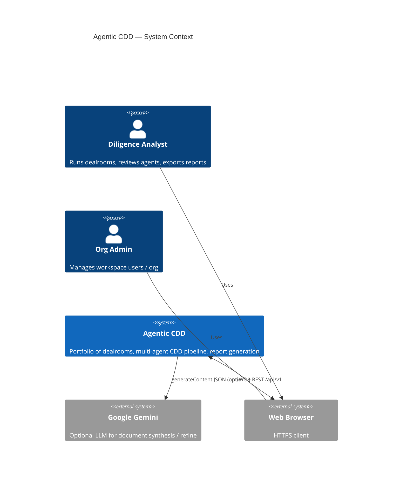

If C4 Mermaid is unavailable in your viewer, use this equivalent flowchart:

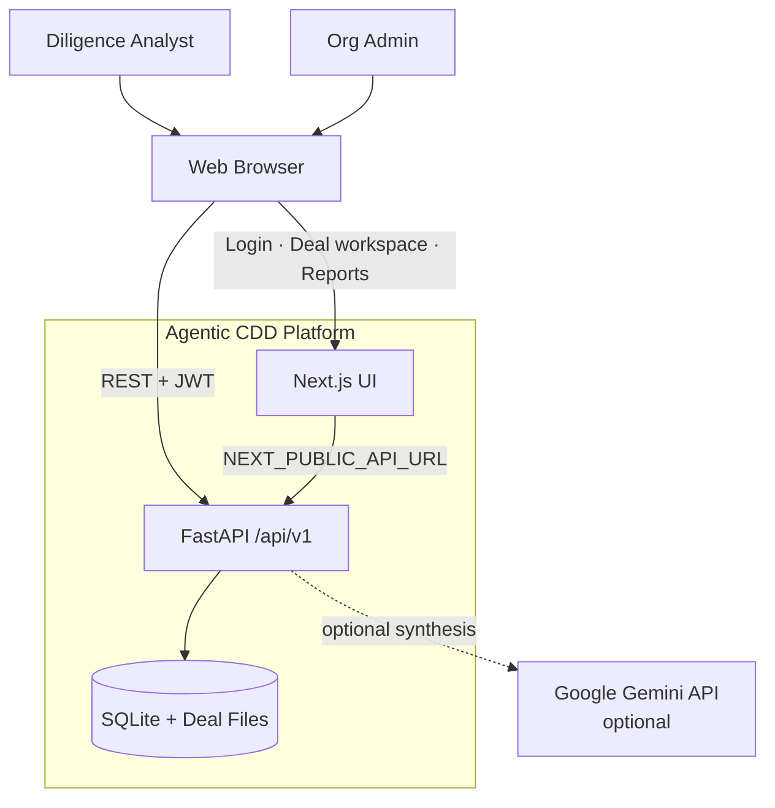

---

## 3. Logical architecture (layers)

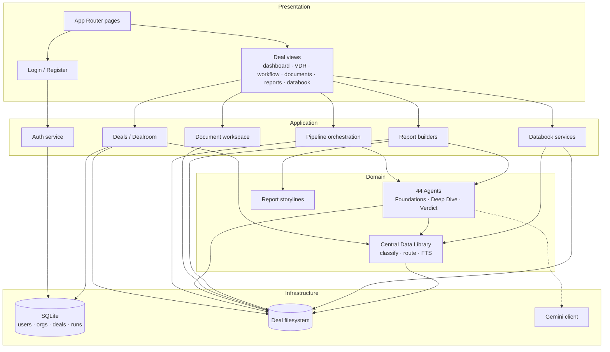

---

## 4. Physical / monorepo structure

```text
agetic-cdd/
├── apps/
│   ├── web/                 # Next.js 15 UI (:3000)
│   │   └── src/
│   │       ├── app/         # Routes: /, /login, /register, /deals/[id], …
│   │       ├── components/  # deal · auth · portfolio
│   │       └── lib/         # api.ts · auth-store
│   └── api/                 # FastAPI (:4600)
│       └── src/agetic_cdd_api/
│           ├── app.py · main.py · settings.py · db.py
│           ├── routers_*.py
│           ├── services_*.py · agent_document_*.py
│           ├── pipeline_catalog.py · deep_dive_roles.py
│           └── report_*.py
├── docs/
│   ├── architecture/        # This document
│   ├── deploy/              # Docker · GCP
│   └── security/
├── Dockerfile.api · Dockerfile.web · docker-compose.yml
└── scripts/deploy-artifact-registry.sh
```

| Process | Port | Image |
|---------|------|--------|
| Web | 3000 (host may remap) | `agetic-cdd-web` |
| API | 4600 | `agetic-cdd-api` |

---

## 5. Component design

### 5.1 Web application (`apps/web`)

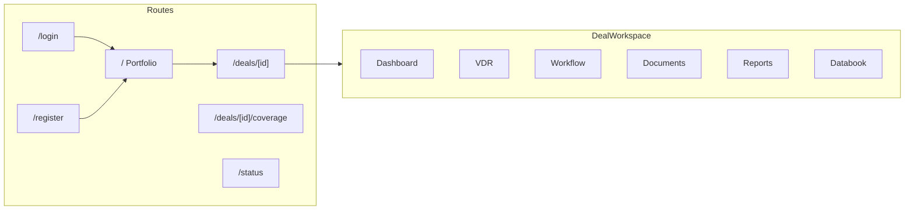

**Deal workspace views** (`?view=`):

| View | Responsibility |
|------|----------------|
| `dashboard` | Deal summary / status |
| `vdr` | Upload & inventory Virtual Deal Room files |
| `workflow` | Run / monitor 5-phase agent pipeline |
| `documents` | Per-agent Document Workspace + copilot |
| `reports` | Generate / download IC packs |
| `databook` | Financial fact extract · DQ · promote |

Auth state: client JWT + refresh via `lib/auth-store` calling `/api/v1/auth/*`.

### 5.2 API application (`apps/api`)

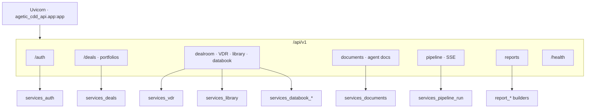

| Router module | Surface |
|---------------|---------|
| `routers_auth.py` | register · login · refresh · logout · me |
| `routers_deals.py` | portfolio / deal CRUD helpers |
| `routers_dealroom.py` | VDR, library, databook, dashboard |
| `routers_documents.py` | Document Workspace + agent markdown |
| `routers_pipeline.py` | Roadmap, phase run, SSE progress |
| `routers_reports.py` | Generate, status, download, storyline |

---

## 6. Authentication & session design

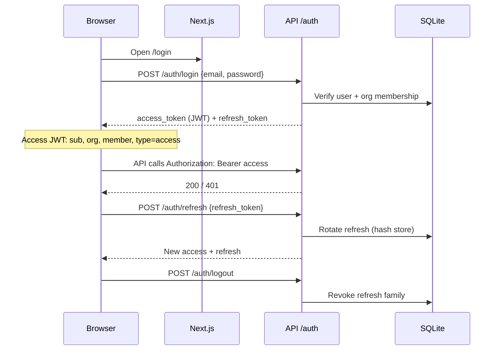

| Token | Lifetime (default) | Storage |
|-------|--------------------|---------|
| Access JWT (HS256) | 24 hours | Client memory / store |
| Refresh (opaque) | 30 days | Hashed in SQLite `refresh_tokens` |

Production: set `AGETIC_CDD_JWT_SECRET` via Secret Manager; never ship defaults.

---

## 7. Deal room & data architecture

### 7.1 Logical entities

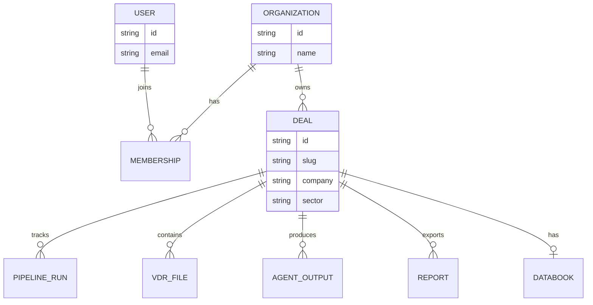

Metadata (users, orgs, deals, pipeline run rows) → **SQLite**.  
Heavy artifacts (VDR bytes, extracts, agent JSON, reports) → **deal filesystem**.

### 7.2 Deal filesystem layout

```text
{AGETIC_CDD_DEALS_STORAGE_PATH}/<slug>/
├── documents/              # Raw VDR uploads
├── library/                # Central Data Library (CDL)
│   ├── index.json
│   ├── routing.json
│   ├── search.db           # FTS
│   ├── documents/*.json    # Extracted text / tables / chunks
│   ├── foundation_roles/   # F-01… context packs
│   ├── agents/<slug>/      # document.md · versions · messages
│   ├── deep_dive_findings.json
│   └── verdict_store.json
├── outputs/<agent_key>.json
├── reports/
│   ├── report_meta.json
│   └── <report_type>/      # .pptx .pdf .docx .xlsx
└── databook/
    ├── meta.json · extract.json · blocks.json
    ├── issues.json · promoted.json · decisions.jsonl
```

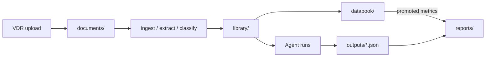

---

## 8. Pipeline architecture (44 agents, 5 phases)

Source of truth: `pipeline_catalog.py`.

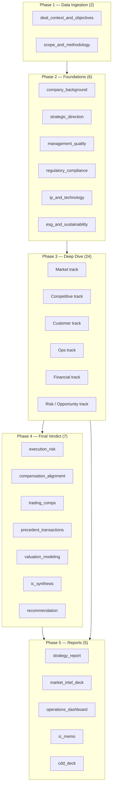

### 8.1 Phase run control flow

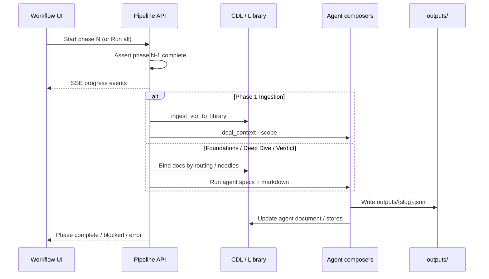

### 8.2 Deep Dive dependency idea

Deep Dive agents form a **DAG** (`deep_dive_roles.py`): many depend on `market_definition` approval and selected Foundation codes (F-01…F-06). Downstream market agents wait until perimeter is approved.

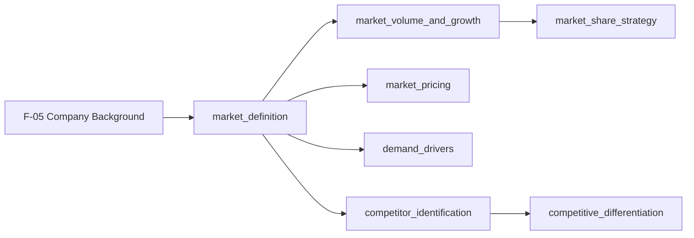

---

## 9. End-to-end diligence journey

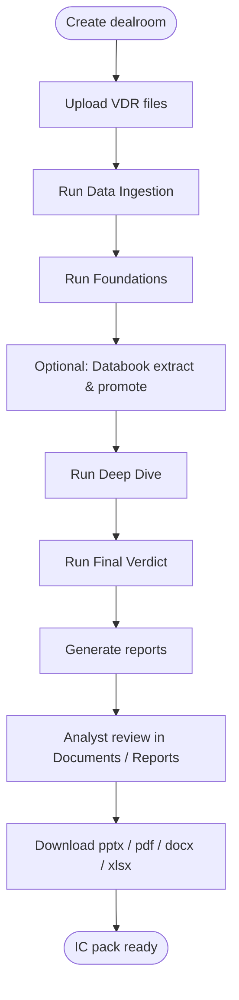

### 9.1 VDR → Library → Agent → Report (detail)

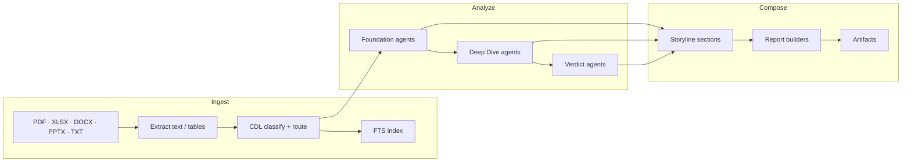

---

## 10. Databook design

**Role:** Reconciled financial fact layer so reports don’t invent P&L / KPI arithmetic from prose alone.

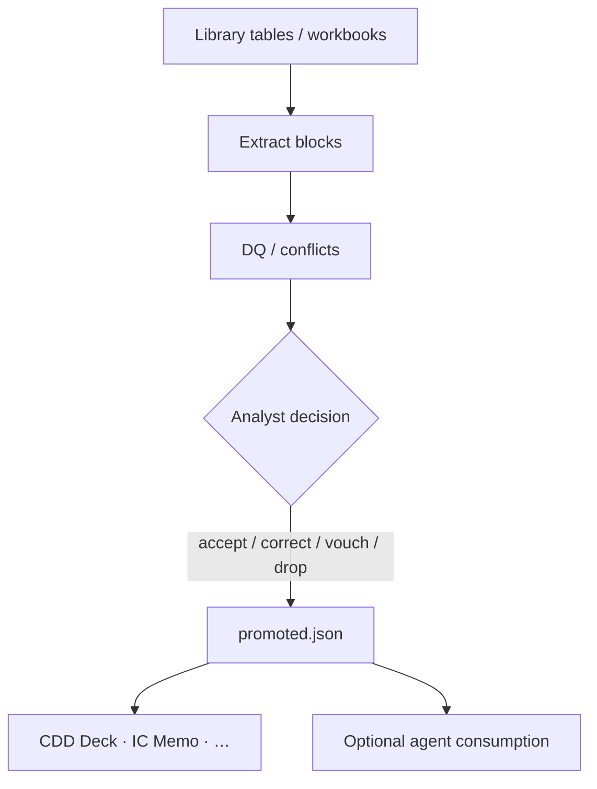

| Artifact | Meaning |
|----------|---------|
| `extract.json` / `blocks.json` | Candidate figures from VDR |
| `issues.json` | Conflicts, gaps, DQ flags |
| `decisions.jsonl` | Audit of analyst actions |
| `promoted.json` | Figures safe for report builders |

UI: Deal → **Databook** (+ DQ affordances on VDR).

---

## 11. Document Workspace & LLM boundary

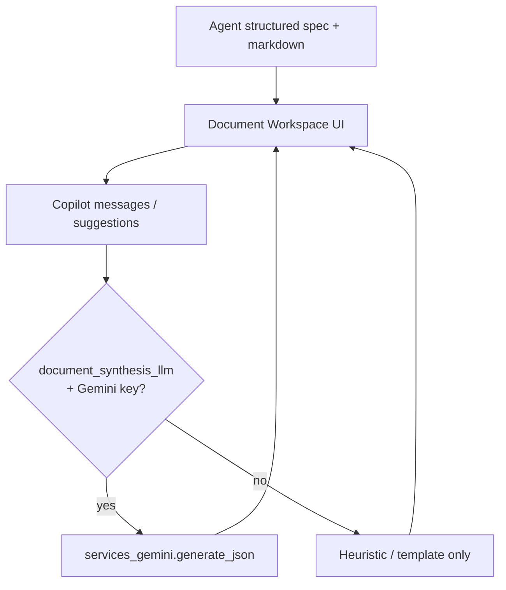

| Flag | Effect |
|------|--------|
| `AGETIC_CDD_DOCUMENT_SYNTHESIS_LLM` | Document Workspace synthesis |
| `AGETIC_CDD_DEEP_DIVE_LLM` | Optional hybrid refine on selected Deep Dive agents |
| Empty `AGETIC_CDD_GEMINI_API_KEY` | Always safe heuristic path |

Central LLM adapter: `services_gemini.py` → `generate_json(system, user) → dict | None`.

---

## 12. Report architecture

| Store key | Catalog / UI name | Format | Builder |
|-----------|-------------------|--------|---------|
| `cdd_deck` | CDD Deck | `.pptx` | `report_cdd_deck.py` |
| `ic_memo` | IC Memo | `.pdf` | `report_ic_memo.py` |
| `market_deck` | Market Intel Deck | `.pptx` | `report_market_deck.py` |
| `strategy_report` | Strategy Report | `.docx` | `report_strategy.py` |
| `ops_dashboard` | Operations Dashboard | `.xlsx` | `report_ops_dashboard.py` |

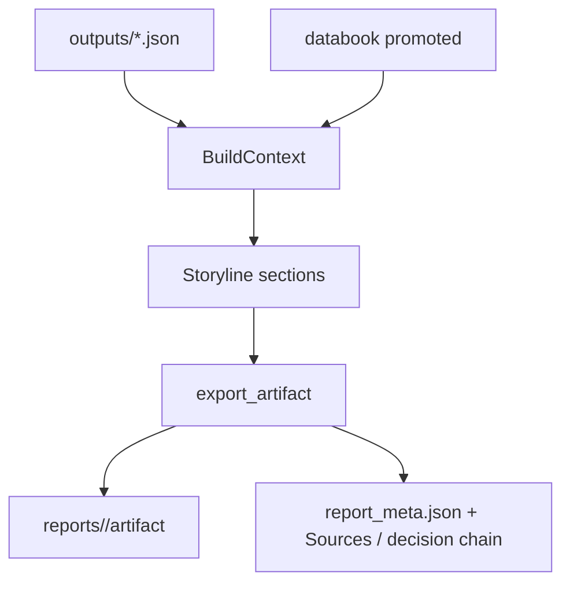

Builders **prefer structured agent specs** (TAM/SAM/SOM, ownership, KPIs) over re-deriving from raw VDR inside the report UI.

---

## 13. Cross-cutting consistency (design rule)

Same deal, same pipeline run → **shared agent outputs are the source of truth**.

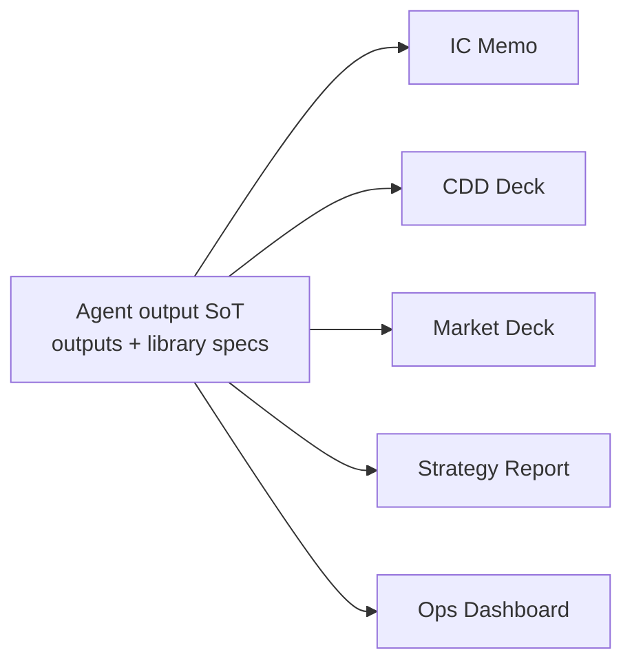

Report-layer patches may sanitize display, but **numbers and perimeter text must be fixed in agents** (e.g. `market_definition`, `company_background`) so all five reports agree.

---

## 14. Technology stack

| Layer | Choice |
|-------|--------|
| UI | Next.js 15 · React 19 · TypeScript · Tailwind |
| API | Python 3.12 · FastAPI · Uvicorn · Pydantic Settings |
| ORM / auth DB | SQLAlchemy 2 · SQLite (Postgres-ready URL later) |
| Documents | pypdf · python-docx · openpyxl · python-pptx · reportlab |
| Search | SQLite FTS in `library/search.db` |
| LLM | Google Gemini REST (optional) |
| Containers | Docker multi-stage · Compose · Artifact Registry |
| Config | `AGETIC_CDD_*` env vars |

---

## 15. Non-functional design

| Concern | Approach |
|---------|----------|
| **Security** | JWT + refresh rotation; CORS allowlist; production forbids localhost/HTTP origins; secrets outside images |
| **Multi-tenancy** | Org membership on every deal access |
| **Durability** | Persist `/data` (SQLite + deals); snapshots on GCP PD |
| **Scalability (today)** | Single API writer for filesystem + SQLite |
| **Scalability (target)** | Cloud SQL + object storage adapter before horizontal API |
| **Observability** | `/api/v1/health`; pipeline SSE; Cloud Logging on GCP |
| **Performance** | Long pipeline/report jobs need raised timeouts / always-on CPU in Cloud Run |

---

## 16. Deployment architecture (summary)

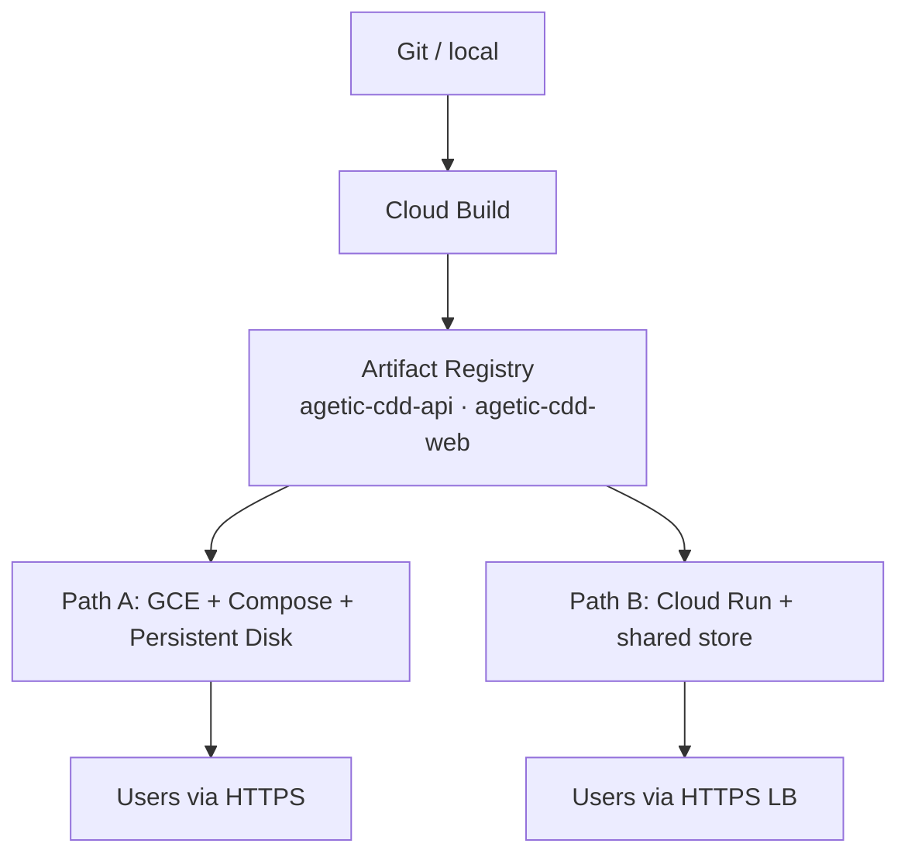

**Recommended first production:** Path A (matches current filesystem design).  
Full GCP detail: [GCP_ARCHITECTURE.md](../deploy/GCP_ARCHITECTURE.md).

---

## 17. Key API surface (quick map)

```text
POST   /api/v1/auth/register|login|refresh|logout
GET    /api/v1/auth/me
GET    /api/v1/health

# Deals / VDR / library / databook  (dealroom + deals routers)
# Documents / agent workspace
# Pipeline roadmap + phase execution (SSE)
# Reports generate / events / download / status
```

Exact paths live in `routers_*.py`; web client wrappers in `apps/web/src/lib/api.ts`.

---

## 18. Design decisions log (selected)

| Decision | Rationale |
|----------|-----------|
| Filesystem deal rooms | Fast iteration; rich binary + JSON artifacts; simple backup |
| Phase-gated pipeline | Prevents Deep Dive/Verdict on empty library |
| Heuristic-first agents | Deterministic extraction; LLM is enrichment not sole source |
| Shared agent SoT for reports | Stops cross-document number drift |
| Separate web/API containers | Independent scale and release of UI vs compute |
| Gemini behind thin adapter | Swap provider later without rewriting agents |

---

## 19. How to read this document

| Audience | Start here |
|----------|------------|
| New engineer | §§2–5, 7–9 |
| Pipeline / agent owner | §§8–11, 13 |
| Report / UI owner | §§5.1, 11–13 |
| DevOps / GCP | §§16 + [GCP deploy doc](../deploy/GCP_ARCHITECTURE.md) |
| Security review | §15 + `docs/security/` |

---

## 20. Related source anchors

| Topic | Path |
|-------|------|
| App wiring | `apps/api/src/agetic_cdd_api/app.py` |
| Pipeline catalog | `pipeline_catalog.py` |
| Deep Dive DAG | `deep_dive_roles.py` |
| Phase runner | `services_pipeline_run.py` |
| VDR / library | `services_vdr.py`, `services_library.py` |
| Databook | `services_databook_*.py` |
| Reports registry | `report_store.py` |
| Settings | `settings.py` |
| Deal UI shell | `apps/web/src/components/deal/DealWorkspace.tsx` |

---

*Version: 2026-04-02 · Application architecture with flowcharts and design rationale for Agentic CDD.*
