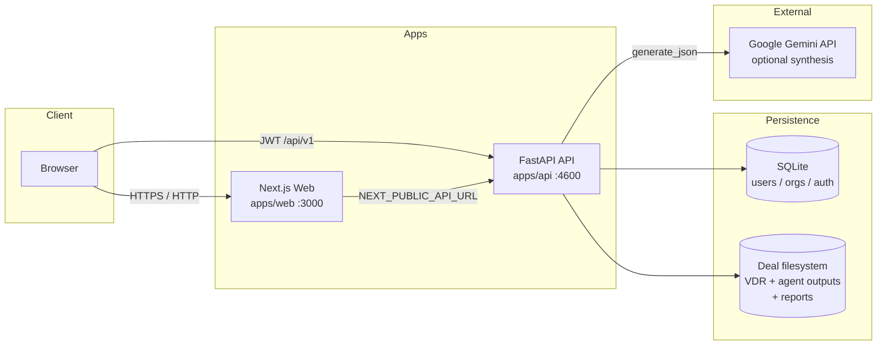
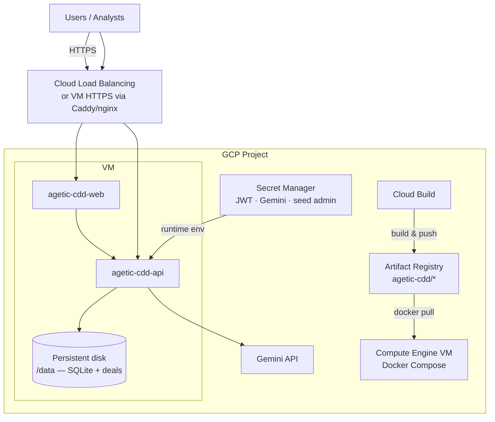
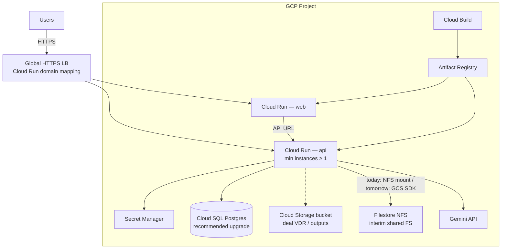
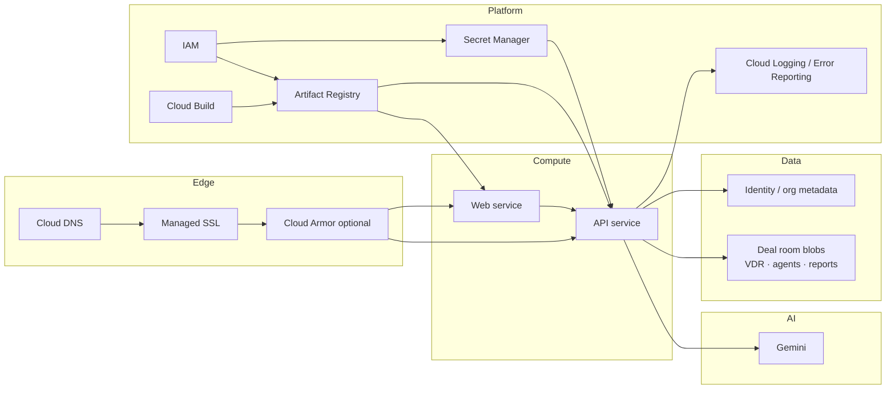
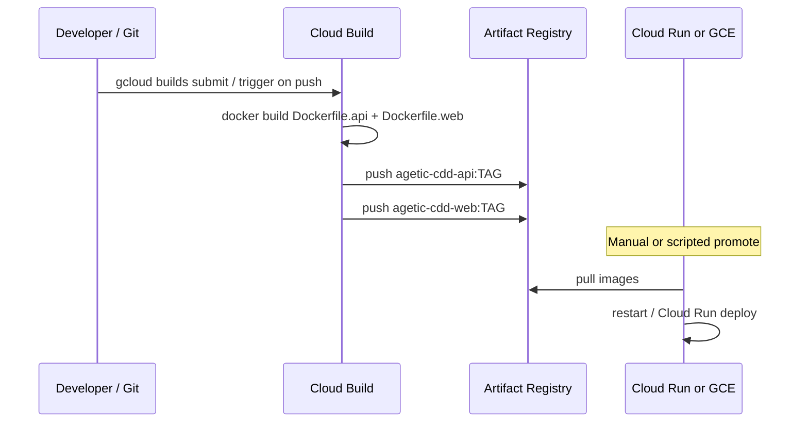

# Agentic CDD — Google Cloud Architecture & Deployment Guide

This document focuses on **deploying Agentic CDD on Google Cloud** (Artifact Registry, Compute Engine / Cloud Run, storage, secrets, CI/CD).

For the full **application architecture** (layers, pipeline, databook, auth, report design, flowcharts), see:

→ **[Application Architecture & Design](../architecture/APPLICATION_ARCHITECTURE.md)**

Related docs:

- [Docker & Artifact Registry](./DOCKER_ARTIFACT_REGISTRY.md) — build/push images
- [Security overview](../security/01-security-overview.md) — product security posture

---

## 1. Goals

| Goal | Outcome |
|------|---------|
| Run Agentic CDD on GCP | HTTPS UI + API reachable by the team |
| Keep VDR / deal data durable | Survives container restarts and redeploys |
| Protect secrets | JWT + Gemini keys in Secret Manager, not in images |
| Repeatable releases | Cloud Build → Artifact Registry → deploy |
| Match today’s code | Prefer paths that work **without** major app rewrites first |

---

## 2. Current application architecture (as built)



### Components

| Layer | Technology | Notes |
|-------|------------|--------|
| **UI** | Next.js 15 (`apps/web`) | `NEXT_PUBLIC_API_URL` is **baked in at image build time** |
| **API** | FastAPI / Uvicorn (`apps/api`) | Prefix `/api/v1`; JWT auth (access + refresh) |
| **Auth DB** | SQLite by default | `AGETIC_CDD_DATABASE_URL` |
| **Deal data** | Local directory tree | `AGETIC_CDD_DEALS_STORAGE_PATH` — VDR files, library index, agent JSON, reports |
| **LLM** | Gemini REST (optional) | `AGETIC_CDD_GEMINI_API_KEY`; heuristics still run without it |
| **Pipeline** | In-process agents | Foundations → Deep Dive → Verdict → Reports (CPU + disk heavy) |
| **Images** | `Dockerfile.api` / `Dockerfile.web` | Published via Artifact Registry |

### Important runtime constraints for cloud

1. **Deal storage is filesystem-based today** — multi-replica Cloud Run without a shared volume will lose or diverge data unless you add object-storage adapters later.
2. **SQLite is single-writer oriented** — fine for one API instance; not ideal for horizontal scale.
3. **Report / deep-dive jobs can be long-running** — Cloud Run request timeouts and CPU allocation must be sized accordingly (or move jobs to Cloud Run Jobs / workers later).
4. **Production CORS** requires HTTPS UI origins only (`AGETIC_CDD_APP_ENV=production`).

---

## 3. Recommended GCP target architecture

Two paths are supported operationally. Start with **Path A** for the fastest production-like deploy; move to **Path B** when you need managed scale.

### Path A — Single VM (fastest; matches Docker Compose)

Best when: small team, one environment, want today’s images with minimal change.



**GCP services used**

| Service | Role |
|---------|------|
| **Artifact Registry** | Store `agetic-cdd-api` / `agetic-cdd-web` images |
| **Cloud Build** | Build from Git / local submit (`cloudbuild.yaml`) |
| **Compute Engine** | Host Docker Compose (or Docker Swarm) |
| **Persistent Disk** | Mount at `/data` for SQLite + deal rooms |
| **Secret Manager** | JWT secret, Gemini key, admin password |
| **Cloud DNS + HTTPS LB / Caddy** | Public hostnames + TLS |
| **VPC / Firewall** | Restrict SSH; allow 80/443 only |

### Path B — Cloud Run (managed containers; needs shared storage plan)

Best when: you want autoscaling, no VM patching, separate web/API services.



| Concern | Cloud Run guidance |
|---------|-------------------|
| **Web** | Stateless — deploy freely; rebuild image when public API hostname changes |
| **API replicas** | Keep **min instances = 1** until Postgres + shared object store exist |
| **Deal files** | **Interim:** Filestore NFS mounted into Cloud Run (2nd gen) **or** stick to Path A. **Target:** GCS bucket + app storage adapter (future work) |
| **Auth DB** | Migrate `AGETIC_CDD_DATABASE_URL` to **Cloud SQL Postgres** before scaling API > 1 |
| **Timeouts** | Raise request timeout for report generation / pipeline endpoints (e.g. 300–900s) or offload to **Cloud Run Jobs** |
| **CPU** | Use CPU always allocated for long pipeline work if requests stay open |

---

## 4. Logical domains on GCP (what goes where)



---

## 5. Environment & secret map

Set these on the **API** service / VM (never bake into images):

| Variable | Production guidance |
|----------|---------------------|
| `AGETIC_CDD_APP_ENV` | `production` |
| `AGETIC_CDD_HOST` | `0.0.0.0` |
| `AGETIC_CDD_PORT` | `4600` (container); expose via LB as 443 |
| `AGETIC_CDD_CORS_ORIGINS` | `https://app.yourdomain.com` (HTTPS only) |
| `AGETIC_CDD_JWT_SECRET` | Secret Manager — long random (≥32 chars) |
| `AGETIC_CDD_DATABASE_URL` | Path A: `sqlite:////data/agetic_cdd.db` · Path B: Cloud SQL URL |
| `AGETIC_CDD_DEALS_STORAGE_PATH` | `/data/deals` (persistent disk / Filestore) |
| `AGETIC_CDD_GEMINI_API_KEY` | Secret Manager |
| `AGETIC_CDD_GEMINI_MODEL` | e.g. `gemini-2.0-flash` / your approved model |
| `AGETIC_CDD_DOCUMENT_SYNTHESIS_LLM` | `true` / `false` |
| `AGETIC_CDD_SEED_ADMIN_*` | Change defaults; prefer create-admin runbook after first boot |

**Web image build args**

| Build arg | Meaning |
|-----------|---------|
| `NEXT_PUBLIC_API_URL` | Public API base, e.g. `https://api.yourdomain.com` |

Rebuild and redeploy **web** whenever this URL changes.

---

## 6. Networking & hostnames (reference layout)

| Hostname | Points to | Backend |
|----------|-----------|---------|
| `app.example.com` | HTTPS LB / Caddy | Web container `:3000` |
| `api.example.com` | HTTPS LB / Caddy | API container `:4600` |

Firewall (Path A VM):

- Ingress: `tcp:22` from admin IPs only; `tcp:80,443` from `0.0.0.0/0` (or corp VPN)
- Egress: HTTPS to Gemini + Artifact Registry + Google APIs

IAM (minimal):

| Principal | Roles |
|-----------|--------|
| Cloud Build SA | `roles/artifactregistry.writer`, `roles/logging.logWriter`, `roles/cloudbuild.builds.builder` |
| Runtime SA (VM / Cloud Run) | `roles/secretmanager.secretAccessor`, `roles/artifactregistry.reader`, optional `roles/storage.objectAdmin` (future GCS) |
| Humans | `roles/run.admin` / `roles/compute.instanceAdmin` as needed — avoid owner on day-to-day |

---

## 7. CI/CD pipeline on GCP



**Already in repo**

| Asset | Purpose |
|-------|---------|
| `Dockerfile.api` / `Dockerfile.web` | Production images |
| `cloudbuild.yaml` | Remote build + push to AR |
| `scripts/deploy-artifact-registry.sh` | Local or `--cloud` push helper |
| `docker-compose.yml` | Local / VM orchestration |
| `.env.docker.example` | Env template |

**Suggested release flow**

1. Tag `vX.Y.Z`
2. Cloud Build with `_TAG=vX.Y.Z` and `_NEXT_PUBLIC_API_URL=https://api.example.com`
3. Deploy API first, then web
4. Smoke: `/api/v1/health`, login, open one deal

---

## 8. Path A — step-by-step deploy (recommended first)

### 8.1 One-time project setup

```bash
export GCP_PROJECT_ID=your-project
export GCP_REGION=us-central1

gcloud config set project "$GCP_PROJECT_ID"
gcloud services enable \
  compute.googleapis.com \
  artifactregistry.googleapis.com \
  cloudbuild.googleapis.com \
  secretmanager.googleapis.com \
  dns.googleapis.com
```

### 8.2 Secrets

```bash
echo -n 'REPLACE_WITH_LONG_RANDOM' | gcloud secrets create agetic-cdd-jwt --data-file=-
echo -n 'YOUR_GEMINI_KEY' | gcloud secrets create agetic-cdd-gemini --data-file=-
```

### 8.3 Build & push images

```bash
cp .env.docker.example .env.docker
# Set GCP_PROJECT_ID, IMAGE_TAG, NEXT_PUBLIC_API_URL=https://api.example.com

./scripts/deploy-artifact-registry.sh --cloud
```

### 8.4 Create VM + disk

```bash
gcloud compute disks create agetic-cdd-data \
  --size=200GB --type=pd-balanced --zone=${GCP_REGION}-a

gcloud compute instances create agetic-cdd-vm \
  --zone=${GCP_REGION}-a \
  --machine-type=e2-standard-4 \
  --boot-disk-size=50GB \
  --image-family=ubuntu-2404-lts-amd64 \
  --image-project=ubuntu-os-cloud \
  --disk=name=agetic-cdd-data,mode=rw \
  --scopes=cloud-platform \
  --tags=agetic-cdd-http
```

Install Docker on the VM, mount the data disk at `/data`, configure Compose with:

```yaml
# Sketch — API volume
volumes:
  - /data/deals:/data/deals
# and SQLite under /data via AGETIC_CDD_DATABASE_URL=sqlite:////data/agetic_cdd.db
```

Pull from Artifact Registry and `docker compose up -d`.

### 8.5 TLS

Put **Caddy** or **nginx + Let’s Encrypt** on the VM (or an HTTPS load balancer in front) terminating TLS for `app.` and `api.` hostnames.

---

## 9. Path B — Cloud Run checklist (after Path A works)

1. Create Artifact Registry images (same as above).
2. Provision **Cloud SQL Postgres**; set `AGETIC_CDD_DATABASE_URL` (requires confirming SQLAlchemy Postgres driver in the image — add `psycopg` / `asyncpg` if not already present).
3. Choose deal storage:
   - **Near-term:** Filestore + Cloud Run volume mount, **or**
   - **Longer-term:** GCS + code to read/write deal trees via the Storage API.
4. Deploy API:

```bash
gcloud run deploy agetic-cdd-api \
  --image=${REGION}-docker.pkg.dev/${PROJECT}/agetic-cdd/agetic-cdd-api:${TAG} \
  --region=${REGION} \
  --allow-unauthenticated=false \
  --min-instances=1 \
  --cpu=2 --memory=4Gi \
  --timeout=900 \
  --set-secrets=AGETIC_CDD_JWT_SECRET=agetic-cdd-jwt:latest,AGETIC_CDD_GEMINI_API_KEY=agetic-cdd-gemini:latest \
  --set-env-vars=AGETIC_CDD_APP_ENV=production,AGETIC_CDD_HOST=0.0.0.0,AGETIC_CDD_CORS_ORIGINS=https://app.example.com
```

5. Rebuild web with `NEXT_PUBLIC_API_URL=https://api.example.com` and deploy Cloud Run web service.
6. Map custom domains; tighten IAM (prefer authenticated Cloud Run + IAP for internal teams).

---

## 10. Data & backup architecture

| Data class | Location today | GCP backup approach |
|------------|----------------|---------------------|
| Users / orgs / sessions | SQLite file | Snapshot Persistent Disk; or dump Cloud SQL |
| VDR uploads | `deals/<slug>/documents` | Disk snapshots / GCS versioning (future) |
| Agent outputs | `deals/<slug>/outputs` | Same as deals |
| Reports | `deals/<slug>/reports` | Same as deals |
| Secrets | Env / Secret Manager | Secret Manager versions + rotation policy |

**RPO/RTO suggestion (starter):** daily disk snapshot, 7–30 day retention; test restore once per quarter.

---

## 11. Observability & ops

| Concern | GCP tool |
|---------|----------|
| Container logs | Cloud Logging (Cloud Run / Ops Agent on GCE) |
| Uptime | Cloud Monitoring uptime check on `/api/v1/health` and `/login` |
| Errors | Error Reporting |
| Cost | Budgets on project; watch Gemini + Cloud Run CPU + disk |
| Deploy audit | Cloud Build history + Artifact Registry digests |

---

## 12. Security controls (GCP mapping)

| Control | Implementation |
|---------|----------------|
| Secrets not in images | Secret Manager + runtime injection |
| TLS everywhere | Managed certs / Caddy |
| Least privilege | Dedicated runtime SA |
| Admin defaults | Change seed admin password immediately |
| CORS lockdown | Production HTTPS origins only |
| Network | Firewall / VPC; optional IAP for private access |
| Supply chain | Pin images by digest from Artifact Registry |
| LLM data path | Gemini key scoped; review data-handling policy for VDR content |

See also `docs/security/` for product-level policy maps.

---

## 13. Sizing (starting point)

| Workload | Path A VM | Path B API (Cloud Run) |
|----------|-----------|-------------------------|
| Light / demos | `e2-standard-2`, 100GB data disk | 1 vCPU / 2Gi, min=1 |
| Real diligence runs | `e2-standard-4` or `e2-standard-8`, 200–500GB SSD | 2–4 vCPU / 4–8Gi, timeout 900s |
| Concurrent pipelines | Prefer queue + jobs (future) | Don’t scale API horizontally until shared store exists |

---

## 14. Migration roadmap

| Phase | Deliverable | App change required? |
|-------|-------------|----------------------|
| **P0** | AR + Cloud Build images | No |
| **P1** | GCE + Compose + TLS + Secret Manager | No |
| **P2** | Monitoring, backups, custom domain | No |
| **P3** | Cloud SQL Postgres | Small (driver + URL) |
| **P4** | Cloud Run web + API (single instance + Filestore) | Mount config only |
| **P5** | GCS-backed deal storage + horizontal API | **Yes** — storage adapter |
| **P6** | Async pipeline workers (Cloud Run Jobs / GKE) | **Yes** — job queue |

---

## 15. Decision summary

| Question | Recommendation |
|----------|----------------|
| Fastest GCP deploy matching current Docker? | **Path A — GCE + Compose + Persistent Disk** |
| Where do images live? | **Artifact Registry** (`agetic-cdd` repo) |
| Where do secrets live? | **Secret Manager** |
| Can we jump straight to multi-instance Cloud Run? | **Not safely** until Postgres + shared deal store |
| What must be set for production CORS? | HTTPS UI origin(s) only + `AGETIC_CDD_APP_ENV=production` |
| What breaks if `NEXT_PUBLIC_API_URL` is wrong? | Browser calls wrong API host — rebuild web image |

---

## 16. Quick reference — smoke tests after deploy

```bash
curl -fsS https://api.example.com/api/v1/health
# Expect: {"ok":true,"service":"agetic-cdd-api",...}

# Open https://app.example.com/login
# Sign in with rotated admin credentials
# Create/open a dealroom · confirm VDR list · generate a small report
```

---

*Document version: 2026-04-02 · Aligns with repo Docker / Artifact Registry assets and filesystem-backed deal storage.*
